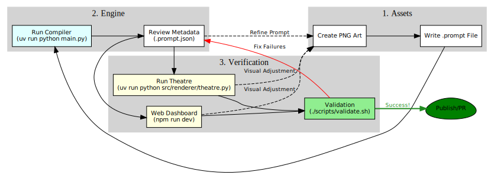

# 🛠️ HOWTO: Develop for Papeterie Engine

This guide covers everything you need to set up, develop, and maintain the Papeterie Engine.

## 1. Prerequisites

Before you begin, ensure you have the following installed:

*   **WSL2** (Ubuntu 22.04 or 24.04 recommended).
*   **Python 3.10+** (The project is pinned to 3.10.x).
*   **Node.js 20+** (Required for the Web Dashboard).
*   **uv**: The primary package manager for Python.
*   **npm**: Node Package Manager.

## 2. Getting Started

### Environment Initialization
The most reliable way to initialize or refresh your environment is to run the automated check script. This script is also automatically called by `validate.sh` and `start_dev.sh`.

```bash
# Automated environment check and setup
./agent_env/bin/ensure_env.sh
```

#### Manual Setup (Fallback)
If the automated script fails or you need more granular control, you can follow these manual steps:

```bash
# 1. Sync Python dependencies and create .venv
uv sync

# 2. Install the project in editable mode (Essential for internal imports)
uv pip install -e .

# 3. Install Web Dashboard dependencies
cd src/web && npm install && cd ../..
```

### Nuclear Reset (Re-Clone)
The absolute cleanest start is to delete the directory and re-clone (shallowly for speed/size).

> [!CAUTION]
> **Backup your `.env` file first!** e.g., `cp .env ../papeterie.env`

```bash
# 1. Delete the directory
cd ..
rm -rf papeterie-clean # or whatever your folder is named

# 2. Shallow Clone (Depth 1 = No History, fast & small)
git clone --depth 1 https://github.com/charojo/papeterie-engine.git papeterie-clean
cd papeterie-clean

# 3. Restore .env
cp ../papeterie.env .env

# 4. Bootstrap
```bash
./agent_env/bin/ensure_env.sh
```

### Repository Footprint
With the shallow clone strategy (`git clone --depth 1`), the project footprint is maybe reasonable for vibe coding:
*   **Repository History (`.git`)**: ~16 MB
*   **Source & Assets**: ~52 MB
*   **Total Source Control**: ~68 MB

The bulk of the disk usage (~1.2 GB) comes from build artifacts and dependencies generated during setup:
*   `.venv` (Python env): ~961 MB
*   `node_modules` (Web env): ~182 MB

The shallow clone strategy is an efficient way to perform a clean start.

### Configuration (`.env`)
You must manually create a `.env` file in the root directory. This file is ignored by Git.

**Create `.env` with the following content:**
```text
GEMINI_API_KEY=your_google_ai_studio_api_key
```

## 3. Core Development Workflows

### Running the Theatre (Engine)
To run a scene locally using the Pygame renderer:
```bash
uv run python src/renderer/theatre.py
```
This opens a Pygame window displaying the animation (default is `scene_sailboat.json`).

### Backend API Server
To start the FastAPI backend:
```bash
uv run fastapi dev src/server/main.py
```
The API will be available at `http://127.0.0.1:8000` (or `localhost`). The engine now supports dynamic origin handling.

### Frontend Web Dashboard
To start the React development server:
```bash
cd src/web
npm run dev
```
The web interface will be available at `http://127.0.0.1:5173` (or `localhost`). The frontend automatically detects the backend host.

## 4. Scripts & Validation

The `bin/` directory contains essential tools for maintenance and validation.

| Task / Script | Command | Description |
| :--- | :--- | :--- |
| **Fast Validation** | `./bin/validate.sh --fast` | LOC-only tests for uncommitted changes (~5s). |
| **Medium Validation** | `./bin/validate.sh --medium` | File-level coverage with auto-fix (~30s). |
| **Full Validation** | `./bin/validate.sh --full` | All tests + E2E, recommended for pre-commit (~90s). |
| **Exhaustive Validation** | `./bin/validate.sh --exhaustive` | Maximum coverage + parallel execution (~5m). |
| **Check AI Models** | `uv run python agent_env/bin/ADE_check_models.py` | Verifies Google AI Studio API access. |
| **Process Assets** | `uv run python bin/process_assets.py` | Utilities for green screen removal, etc. |
| **Diagrams** | `uv run python agent_env/bin/ADE_generate_diagrams.py` | Converts `.dot` files to SVGs. |
| **Analyze Coverage** | `./agent_env/bin/ADE_analyze.sh` | Generates a coverage report from validation logs. |
| **Start Dev Stack** | `./bin/start_dev.sh` | Starts both backend and frontend via tmux. |

## 5. IDE & AI Agent Setup

### VS Code Integration
1. Ensure the `.vscode/settings.json` file exists.
2. If the terminal doesn't show `(.venv)`, use `Ctrl+Shift+P` -> `Python: Select Interpreter` and select the path to `./.venv/bin/python`.
3. **Recommended Extensions**:
    *   **Python** (Microsoft): Core Python language support.
    *   **Markdown All in One**: Enhanced markdown editing and preview.
    *   **ESLint**: JavaScript/React linting.
    *   **Prettier**: Code formatting.
    *   **Python Debugger**: Direct test execution and debugging.

### AI Agent Initialization (Gemini/Claude)
When starting a new session with an AI Agent:
1. Enable **Agent Mode** in the IDE.
2. Instruct the AI: *"Read HOWTO_develop.md and AGENTS.md to initialize project context."*

### Antigravity Integration & Living HOWTO
We use the Antigravity agent as the canonical assistant for development tasks and for capturing issues encountered during work on feature branches. Follow these steps when you start work on a backlog item (for example, a `clean development` pull):

1. Enable **Agent Mode** and ensure the Antigravity brain is available at `.gemini/antigravity/brain` (the project already reserves this path).
2. Start an Antigravity session and ask it to scan `docs/HOWTO_Develop.md`, `docs/AGENTS.md`, and `docs/BACKLOG.md` (the project backlog is the canonical ledger for issues).
3. For every blocker, environment quirk, or procedural gap you encounter, run the helper script to record it immediately (see `bin/ADE_capture_issue.sh`). This creates a timestamped entry in `docs/BACKLOG.md` so the HOWTO can be updated incrementally.
4. After resolving an issue or completing a task, update `docs/HOWTO_Develop.md` with the fix or guidance and mark the corresponding `docs/BACKLOG.md` entry as resolved by appending `- RESOLVED: <date> by <your-name>` under the issue.
5. Run `python agent_env/bin/ADE_update_workflow_docs.py` when you add or change agent workflows so `docs/HOWTO_Agent_Workflows.md` stays in sync.

Guidelines for living documentation
- Record issues at the moment they occur; short, factual notes are best.
- Prefer step-by-step remediation notes (commands and expected output) when possible.
- Use the branch and PR to propose HOWTO changes; the PR description should reference `docs/BACKLOG.md` entries you addressed.


Example capture flow:

```bash
# Start working on feature branch
git checkout -b feature/clean-development

# When you hit a missing env var or a failing test, capture it:
./agent_env/bin/ADE_capture_issue.sh "Missing GEMINI_API_KEY in .env when running uv run pytest -m live"

# After fixing, append a resolution note to the issue entry and update HOWTO
git add docs/BACKLOG.md docs/HOWTO_Develop.md && git commit -m "docs: record and resolve env var issue in HOWTO"
```

## 6. Project Directory Structure

*   `src/compiler/`: LLM integration and metadata generation.
*   `src/renderer/`: Pygame and MoviePy rendering logic.
*   `src/server/`: FastAPI backend routes.
*   `src/web/`: React frontend source.
*   `assets/sprites/`: Source `.png` files and generated `.prompt.json` metadata.
*   `assets/prompts/`: Meta-instruction templates for Gemini.
*   `docs/`: Project documentation and architecture diagrams.
*   `tests/`: Comprehensive behavioral test suite.

## 7. Maintenance & Governance

### Branch Protection
The `main` branch is protected. To contribute:
1.  `git checkout -b feature/your-feature-name`
2.  Commit changes and `git push origin feature/your-feature-name`
3.  Open a Pull Request on GitHub. (All tests must pass).

## 8. Troubleshooting

*   **WSL Mouse/Input Lag**: If the mouse becomes unresponsive in Pygame windows, run `wsl --shutdown` from Windows and restart.
*   **VS Code Sync**: If the `(.venv)` prompt is missing, restart the terminal after selecting the correct interpreter.
*   **Asyncio Warnings**: Ensure `pytest-asyncio` is installed and `pyproject.toml` has the correct loop scope configuration.
*   **Git Auth**: If terminal push fails, use the VS Code Source Control sidebar to "Publish Branch."
*   **WSL Connection Drops**: Avoid running `pkill -f "node"` as it kills the VS Code Server. Use specific process killing (e.g., `lsof -ti:PORT | xargs kill`) instead.
*   **Validation Hangs/Crashes**: If `validate.sh` hangs or crashes WSL, it's likely memory pressure from E2E tests (Chromium). Run `validate.sh --full --skip-e2e` for lighter validation, or ensure you have ample free RAM (close other VS Code windows). Check for zombie processes with `pkill -f chrome || true`.

## 9. Human Development Workflow

The typical development cycle involves an iterative loop between asset creation, metadata generation, and visual verification.


*(Source: [development_workflow.dot](assets/diagrams/development_workflow.dot))*

1.  **Asset Creation**: Design RGBA `.png` sprites and write initial `.prompt` files.
2.  **Compilation**: Run `uv run python main.py` to generate `.prompt.json` via Gemini.
3.  **Visual Feedback**: Use `theatre.py` or the Web Dashboard to see the animation in action.
4.  **Refinement**: Adjust prompts or art based on visual results and re-compile.
5.  **Validation**: Run `./bin/validate.sh` to ensure no regressions before committing.


## 10. CSS Debugging & Safaris

We use a "Safe CSS" workflow to prevent visual regressions during refactoring.

### Refactoring Methodology
1.  **Check Baseline**: Run `./agent_env/bin/ADE_safe_css.sh` to ensure current state passes (or generate baseline snapshots).
2.  **Refactor**: Make your CSS changes.
3.  **Verify**: Run `./agent_env/bin/ADE_safe_css.sh` again.
    *   **Success**: `✅ CSS Safety Checks PASSED`.
    *   **Failure**: The script will point you to the report. Open `src/web/playwright-report/index.html` to compare Before/After images.

### System Health
If the validation script fails immediately, the dev server might be down. Run `./agent_env/bin/ADE_check_health.sh` to diagnose.

## 11. Working with Antigravity & AI

As an agentic engine, Papeterie is designed to be co-developed with AI agents like Antigravity.

*   **Prompt Engineering**: Use Antigravity to draft and refine `.prompt` files. The models are excellent at translating visual descriptions into the engine's physics-based parameters.
*   **Automated Fixups**: The engine uses Gemini 3 Pro to automatically repair malformed JSON. If you encounter validation errors, check `logs/` to see the AI's reasoning.
*   **Brain Artifacts**: Antigravity maintains state in the `.gemini/antigravity/brain` directory. This context helps the AI understand your current implementation plan and task status.

## 11. Design Documentation

For deep dives into specific system architectures, refer to the following design documents:

*   **[High Level Design](design/high_level_design.md)**: Overall system architecture and goals.
*   **[Scene Editing Architecture](design/scene_editing_architecture.md)**: Deep dive into the web-based scene editor and state management.
*   **[Persistence & User Design](design/persistence_and_user_design.md)**: How assets and user data are stored and managed.
*   **[Verification Strategy](design/verification.md)**: Detailed breakdown of the testing and validation layers.
*   **[Undo/Redo System](design/undo_redo_system.md)**: Command pattern architecture for reversible actions.
*   **[Issues & Refactoring](ISSUES.md)**: Consolidated architecture issues, refactoring plans, and historical regressions.
*   **[Junior Dev Ecosystem](design/junior_dev_ecosystem.md)**: Guidance for junior developers and AI agents working on the project.
