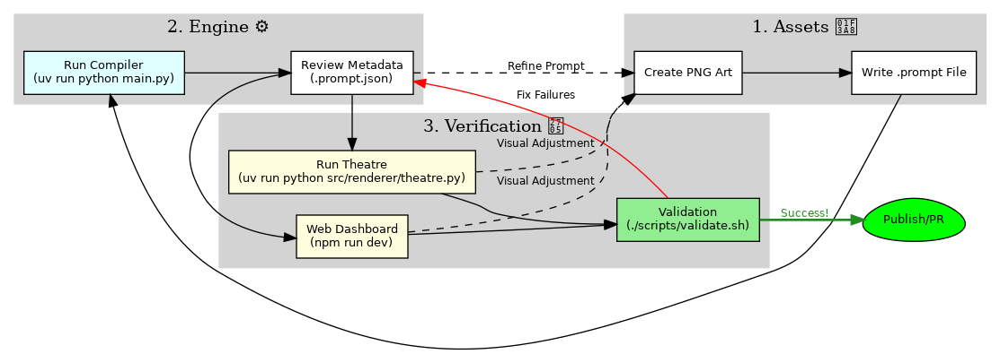

# 🛠️ HOWTO: Develop for Papeterie Engine

This guide covers everything you need to set up, develop, and maintain the Papeterie Engine.

## 1. Prerequisites

Before you begin, ensure you have the following installed:

*   **WSL2** (Ubuntu 22.04 or 24.04 recommended).
*   **Python 3.10+** (The project is pinned to 3.10.x).
*   **Node.js 20+** (Required for the Web Dashboard).
*   **uv**: The primary package manager for Python.
*   **npm**: Node Package Manager.

## 2. Getting Started

### Environment Initialization
Run these commands to build your local development environment:

```bash
# 1. Sync Python dependencies and create .venv
uv sync

# 2. Install the project in editable mode (Essential for internal imports)
uv pip install -e .

# 3. Install Web Dashboard dependencies
cd src/web && npm install && cd ../..
```

### Configuration (`.env`)
You must manually create a `.env` file in the root directory. This file is ignored by Git.

**Create `.env` with the following content:**
```text
GEMINI_API_KEY=your_google_ai_studio_api_key
```

## 3. Core Development Workflows

### Running the Theatre (Engine)
To run a scene locally using the Pygame renderer:
```bash
uv run python src/renderer/theatre.py
```
This opens a Pygame window displaying the animation (default is `scene_sailboat.json`).

### Backend API Server
To start the FastAPI backend:
```bash
uv run fastapi dev src/server/main.py
```
The API will be available at `http://localhost:8000`.

### Frontend Web Dashboard
To start the React development server:
```bash
cd src/web
npm run dev
```
The web interface will be available at `http://localhost:5173`.

## 4. Scripts & Validation

The `scripts/` directory contains essential tools for maintenance and validation.

| Task / Script | Command | Description |
| :--- | :--- | :--- |
| **Full Validation** | `./scripts/validate.sh` | Runs linting (Ruff, ESLint), formatting, and all tests. |
| **Smart Tests** | `./scripts/smart_validate.sh` | Runs only tests affected by uncommitted changes. |
| **Check AI Models** | `uv run python scripts/check_models.py` | Verifies Google AI Studio API access. |
| **Process Assets** | `uv run python scripts/process_assets.py` | Utilities for green screen removal, etc. |
| **Diagrams** | `uv run python scripts/generate_diagrams.py` | Converts `.dot` files to PNGs. |
| **Analyze Coverage** | `./scripts/analyze.sh` | Generates a coverage report from validation logs. |
| **Start Dev Stack** | `./scripts/start_dev.sh` | Starts both backend and frontend via tmux. |

## 5. IDE & AI Agent Setup

### VS Code Integration
1. Ensure the `.vscode/settings.json` file exists.
2. If the terminal doesn't show `(.venv)`, use `Ctrl+Shift+P` -> `Python: Select Interpreter` and select the path to `./.venv/bin/python`.
3. Use the **Python Debugger** extension for direct test execution.

### AI Agent Initialization (Gemini/Claude)
When starting a new session with an AI Agent:
1. Enable **Agent Mode** in the IDE.
2. Instruct the AI: *"Read HOWTO_develop.md and AGENTS.md to initialize project context."*

## 6. Project Directory Structure

*   `src/compiler/`: LLM integration and metadata generation.
*   `src/renderer/`: Pygame and MoviePy rendering logic.
*   `src/server/`: FastAPI backend routes.
*   `src/web/`: React frontend source.
*   `assets/sprites/`: Source `.png` files and generated `.prompt.json` metadata.
*   `assets/prompts/`: Meta-instruction templates for Gemini.
*   `docs/`: Project documentation and architecture diagrams.
*   `tests/`: Comprehensive behavioral test suite.

## 7. Maintenance & Governance

### Branch Protection
The `main` branch is protected. To contribute:
1.  `git checkout -b feature/your-feature-name`
2.  Commit changes and `git push origin feature/your-feature-name`
3.  Open a Pull Request on GitHub. (All tests must pass).

## 8. Troubleshooting

*   **WSL Mouse/Input Lag**: If the mouse becomes unresponsive in Pygame windows, run `wsl --shutdown` from Windows and restart.
*   **VS Code Sync**: If the `(.venv)` prompt is missing, restart the terminal after selecting the correct interpreter.
*   **Asyncio Warnings**: Ensure `pytest-asyncio` is installed and `pyproject.toml` has the correct loop scope configuration.
*   **Git Auth**: If terminal push fails, use the VS Code Source Control sidebar to "Publish Branch."

## 9. Human Development Workflow

The typical development cycle involves an iterative loop between asset creation, metadata generation, and visual verification.


*(Source: [development_workflow.dot](assets/diagrams/development_workflow.dot))*

1.  **Asset Creation**: Design RGBA `.png` sprites and write initial `.prompt` files.
2.  **Compilation**: Run `uv run python main.py` to generate `.prompt.json` via Gemini.
3.  **Visual Feedback**: Use `theatre.py` or the Web Dashboard to see the animation in action.
4.  **Refinement**: Adjust prompts or art based on visual results and re-compile.
5.  **Validation**: Run `./scripts/validate.sh` to ensure no regressions before committing.

## 10. Working with Antigravity & AI

As an agentic engine, Papeterie is designed to be co-developed with AI agents like Antigravity.

*   **Prompt Engineering**: Use Antigravity to draft and refine `.prompt` files. The models are excellent at translating visual descriptions into the engine's physics-based parameters.
*   **Automated Fixups**: The engine uses Gemini 3 Pro to automatically repair malformed JSON. If you encounter validation errors, check `logs/` to see the AI's reasoning.
*   **Brain Artifacts**: Antigravity maintains state in the `.gemini/antigravity/brain` directory. This context helps the AI understand your current implementation plan and task status.

## 11. Design Documentation

For deep dives into specific system architectures, refer to the following design documents:

*   **[High Level Design](design/high_level_design.md)**: Overall system architecture and goals.
*   **[Scene Editing Architecture](design/scene_editing_architecture.md)**: Deep dive into the web-based scene editor and state management.
*   **[Persistence & User Design](design/persistence_and_user_design.md)**: How assets and user data are stored and managed.
*   **[Junior Dev Ecosystem](design/junior_dev_ecosystem.md)**: Guidance for junior developers and AI agents working on the project.
*   **[Verification Strategy](design/verification.md)**: Detailed breakdown of the testing and validation layers.
