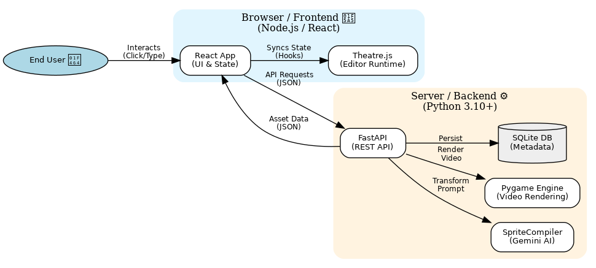
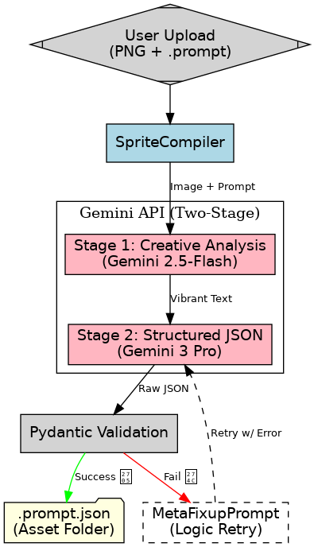
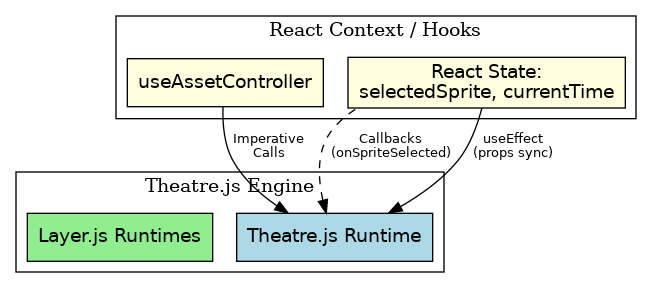
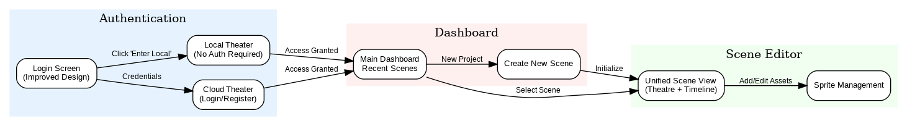
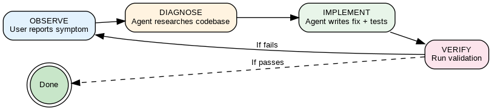
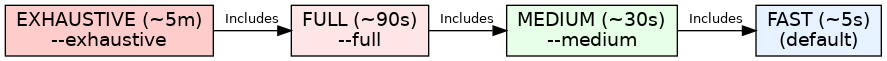

# Building the Papeterie Engine: Architecture, AI Partnership, and the Future of Coding

*A deep dive into the Toy Theatre engine's design and the Agent-in-the-Loop methodology that built it.*

---

---

### The Role of Automation as Product

Kevin Surace’s framing of modern tool-building—treating automation as a first-class product rather than an afterthought—served as a useful forcing function as I built Papeterie Engine. It sharpened a set of questions I was already wrestling with: where the “authoritative truth” of a creative system should live, how to keep multi-runtime implementations from drifting, and how to build validation so rigorously that iteration stays fast without becoming fragile.

This post explores how those pressures turned into concrete architecture: a schema-first compiler pipeline, dual-runtime parity safeguards, React ↔ Theatre synchronization patterns, and a QA reasoning loop that made iteration dependable.


<br>
Source: <a href="https://github.com/charojo/papeterie-engine/blob/master/docs/assets/diagrams/high_level_architecture.dot">high_level_architecture.dot</a>


---

## Part 1: The Engine Architecture

The engine is built on a strict **Compiler-Renderer** separation. This allows us to use high-powered AI for asset preparation while maintaining a lightweight, high-performance runtime for animation.

### 1.1 The High-Level Pipeline


<br>
Source: <a href="https://github.com/charojo/papeterie-engine/blob/master/docs/assets/diagrams/detailed_pipeline_flow.dot">detailed_pipeline_flow.dot</a>

### 1.2 The Two-Stage Gemini Pipeline

LLM outputs are notoriously creative but often unreliable with strict schemas. We solved this by splitting metadata generation into two distinct stages:

1.  **Stage 1: Creative Analysis (Gemini 2.5-Flash)**: The model analyzes the sprite's visual "vibe" and motion intent in free-form text.
2.  **Stage 2: Structured Generation (Gemini 3 Pro)**: A second pass translates that intent into a rigid JSON structure that matches our Pydantic models.

#### The Validation-Fixup Loop

If the LLM returns invalid JSON or physically impossible parameters (e.g., an oscillation frequency of 1000Hz), the engine catches the error via Pydantic and triggers an automatic fixup:

```python
# Recursive Fixup Pattern
async def generate_metadata(self, prompt, sprite_path, attempts=3):
    try:
        raw_json = await self._call_llm(prompt)
        return SpriteMetadata.model_validate_json(raw_json)
    except ValidationError as e:
        if attempts > 0:
            return await self.fixup(raw_json, e.errors(), attempts - 1)
        raise
```

### 1.3 Component Map Architecture (React ↔ Pygame)

The frontend uses a **Component Map Architecture**, allowing a modern React UI to control a legacy-style imperative engine (`Theatre.js`) through a shared state model.

#### State Synchronization Pattern

We avoid "two sources of truth" by using `useEffect` hooks to push React state updates into the imperative engine.


<br>
Source: <a href="https://github.com/charojo/papeterie-engine/blob/master/docs/assets/diagrams/react_theatre_sync.dot">react_theatre_sync.dot</a>

The `useAssetController` hook acts as the central bridge, handling API persistence, selection state, and the command chain.

### 1.4 The Animation Runtime

The runtime applies modular **Behaviors** to sprite transforms every frame.

#### Timeline Synchronicity & Environmental Reactions
The `elapsedTime` is the single source of truth. The engine supports complex interactions, like a boat tilting on ocean waves, using the "Pivot on Crest" algorithm which samples the height of the "target" layer dynamically.

### 1.5 Dual-Runtime Parity

A core architectural challenge—and one highlighted by the Surace context—is preventing "drift" when you have two separate physics engines. We have a Python backend (for accurate MP4 video rendering) and a JavaScript frontend (for real-time editing).

If these two drift, the user sees one thing in the editor but gets a different result in the video.

We solved this with **Schema-First Parity**:
-   The **Pydantic Models** in `src/compiler/models.py` act as the single source of truth.
-   Both the Python `theatre.py` and the JavaScript `Theatre.js` implement the **same math** (e.g., the Pivot-on-Crest algorithm) derived strictly from these models.
-   We treat the JSON output from the compiler as a "Parity Contract." If the JSON says `tilt: 15deg`, both engines must respect it, regardless of their underlying language.

### 1.6 UX Flow and User Journey Coherence

The rigorous backend architecture ultimately serves the user experience. The flow was designed to mimic the "Creator's Loop": Prepare -> Assemble -> Refine.


<br>
Source: <a href="https://github.com/charojo/papeterie-engine/blob/master/docs/assets/diagrams/user_journey_2026_01_09.dot">user_journey_2026_01_09.dot</a>

The journey is segmented to isolate complexity:
1.  **Login/Dashboard**: Administrative management of assets.
2.  **Sprite Compilation**: The "magic" phase where LLMs generate behaviors.
3.  **Scene Editor**: The "craft" phase where users compose the scene.

This separation prevents the "cockpit problem" where every tool is visible at once. By strictly enforcing these boundaries in the router (`src/web/src/App.jsx`), we ensure the user is only ever solving one problem at a time.

---

## Part 2: The AI Partnership & Methodology

Our collaboration evolved through three distinct phases as the project's complexity grew:

1.  **The Assistant**: Generating code from detailed prompts.
2.  **The Consultant**: Diagnosing complex environment issues (like WSLg lag).
3.  **The Meta-Developer**: Improving the *development process* itself (e.g., building the validation system).

### 2.1 The Agent-in-the-Loop Workflow

The engine uses a collaborative debugging partner model where the agent handles research and implementation while the human provides vision and judgment.


<br>
Source: <a href="https://github.com/charojo/papeterie-engine/blob/master/docs/assets/diagrams/agent_in_the_loop.dot">agent_in_the_loop.dot</a>

### 2.2 Prompt Memory vs. Git History

One of the most powerful aspects of this partnership is the **Prompt History**. It serves as a **Catastrophe Recovery** layer. Even if local state is wiped, the **Intent and Reasoning** survive in the AI partner's memory, allowing for instant re-implementation and access to the *why* behind decisions.

| Feature | Git History (The *What*) | Prompt History (The *How* & *Why*) |
|---------|-------------------------|-----------------------------------|
| **Storage** | Local `.git` folder | AI Platform (Cloud) |
| **Resilience** | Wiped by local resets | Survives all local deletions |
| **Context** | Shows the final diff | Records reasoning and failed attempts |

### 2.3 Case Studies in Collaboration

*   **WSL Input Capture Lock**: The agent recognized environmental issues (WSLg display server caching) that I mistook for code bugs.
*   **Theatre Selection Size**: The agent identified a type mismatch where the Timeline sent an object but the Theatre expected a string.
*   **Drift Behavior Bug**: The agent followed a "detect-trace-hypothesize" loop to find that `drift_cap` was not enforced in the runtime `apply()` method.

---

## Part 3: Quality Assurance & Tooling

To keep the feedback loop fast, we implemented a **Tiered Validation System** and a catalog of **Agentic Workflows**.

### 3.1 Tiered Validation


<br>
Source: <a href="https://github.com/charojo/papeterie-engine/blob/master/docs/assets/diagrams/tiered_validation.dot">tiered_validation.dot</a>

*   **Fast**: Runs only tests affected by changed lines (LOC-based gating).
*   **Full**: Pre-merge check with all tests.
*   **Exhaustive**: Release-level deep analysis.

This reduced quick fix validation time from **2 minutes (--full) to 5 seconds (--fast, depending on changeset)**.

**Token Optimization**: Fast local validation also directly impacts our "AI Economics." By catching errors early with targeted tests, the agent doesn't need to waste tokens reading thousands of lines of logs from a full suite run. It gets immediate, localized feedback, keeping the Context Window clean and focusing the reasoning loop strictly on the relevant changes.


```text
========================================================
Codebase Summary
========================================================

  Metric               Backend         Frontend        Total          
  -------------------- --------------- --------------- ---------------
  Files                25              57              82             
  LOC                  3273            10144           13417          
  TODOs                1               1               2              
  FIXMEs               0               0               0              
  --------------------------------------------------------------------


========================================================
Validation Summary
========================================================

                                  Tests   Coverage     Time
  ------------ ------------------------   -------- --------
  Frontend                   227 passed        59%       5s
  E2E                          8 passed        35%      25s
  Backend      140 passed, 2 skipped           83%      50s
  Contrast            12 tests (Passed)          -        -
  CSS                 4 checks (Passed)          -        -
  Paths                1 check (Passed)          -        -
  Auto-Fix                         Done          -       2s
  ------------ ------------------------   -------- --------
  TOTAL                                     71.00%      82s
  ------------ ------------------------   -------- --------

  * 2 skipped are live API tests (use --live to run)
```

### 3.2 Registered Agentic Workflows

### 3.2 Registered Agentic Workflows

These workflows are powered by **Antigravity**, the agentic engine that drives our development. Unlike standard scripts, these are "reasoning checklists"—structured Standard Operating Procedures (SOPs) that the agent reads to understand *how* to perform complex multi-step tasks like a security review or a design validation.

The agent references these workflows to ensure consistency, effectively "training" itself on the project's specific culture and requirements without human micromanagement.

| Workflow | Description | Source |
| :--- | :--- | :--- |
| **Add Scene** | SOP for adding new scenes, ensuring all metadata and assets are correctly placed. | [`/add-scene`](https://github.com/charojo/papeterie-engine/blob/master/.agent/workflows/add-scene.md) |
| **Architecture** | Guidelines for implementing architectural changes and big features. | [`/architecture`](https://github.com/charojo/papeterie-engine/blob/master/.agent/workflows/architecture.md) |
| **Cleanup** | Routine for cleaning up system files, caches, and logs. | [`/cleanup`](https://github.com/charojo/papeterie-engine/blob/master/.agent/workflows/cleanup.md) |
| **CSS Review** | Checklist for reviewing CSS compliance against the design system. | [`/css-review`](https://github.com/charojo/papeterie-engine/blob/master/.agent/workflows/css-review.md) |
| **Design Planning** | Process for planning UI/UX and system design tasks. | [`/design-planning`](https://github.com/charojo/papeterie-engine/blob/master/.agent/workflows/design-planning.md) |
| **Docs Path Integrity** | Standards for maintaining relative paths in documentation. | [`/docs-path-integrity`](https://github.com/charojo/papeterie-engine/blob/master/.agent/workflows/docs-path-integrity.md) |
| **Security Review** | Basic security review checklist. | [`/security-review`](https://github.com/charojo/papeterie-engine/blob/master/.agent/workflows/security-review.md) |
| **UX Review** | Accessibility and UX consistency review protocols. | [`/ux-review`](https://github.com/charojo/papeterie-engine/blob/master/.agent/workflows/ux-review.md) |
| **Validate** | The comprehensive QA validation strategy. | [`/validate`](https://github.com/charojo/papeterie-engine/blob/master/.agent/workflows/validate.md) |

---

## Part 4: The Compilation Journey

Every major milestone in the Papeterie Engine was preceded by a "Compilation Session"—a deep dialogue between human intent and architectural reasoning.

| Milestone | Innovation |
|-----------|------------|
| **Project Inception** | Python-based Pydantic schema-first design. |
| **Stage 1 & 2** | Two-stage Gemini analysis and validation-fixup loop. |
| **Timeline v2** | Keyframe interpolation and real-time scrubbing. |
| **User Isolation** | Multi-tenant directory structures for assets. |

### The Compiler's Ledger

| Session Title | Context Depth | Key "Compiler Artifact" |
|---------------|---------------|-------------------------|
| **Scene Optimization** | 450 KB | `GeminiCompilerClient.decompose_scene` |
| **Unified Location** | 320 KB | `LocationRuntime` & Interp Logic |
| **Stability Playbook** | 850 KB | 6-Phase Stability Playbook |
| **Selection Sync** | 180 KB | `useAssetController` selection bridge |

---

## Part 5: Future Roadmap

We are continuously evolving the engine. Our current backlog focuses on hardening the validation pipeline and expanding the visual test suite.

*   **Git Hooks for Validation**: Ensuring that `validate.sh` runs automatically on pre-commit/push to prevent broken code from entering the repo ([IDEA-015](../BACKLOG.md)).
*   **Visual Regression Testing**: Automating the detection of rendering regressions by comparing output frames against "known good" baselines.
*   **E2E Playwright Flows**: Expanding our end-to-end coverage to include full playback verification.

## Part 6: Conclusion & Call to Action

The Papeterie Engine architecture demonstrates that you don't have to choose between modern web flexibility and high-performance imperative rendering. By using a strictly defined metadata contract and a bidirectional sync bridge, we created a tool that is both AI-smart and manually precise.

But more importantly, it proved that the **Human-AI Partnership** allows us to move from "coding" to "architecting"—delegating the tedious parts to build faster, smarter, and with greater resilience.

### Ready to Build?

This project is open source and we are actively looking for contributors to help push the boundaries of AI-assisted creative tooling.

*   **Explore the Code**: Clone the repository at [github.com/charojo/papeterie-engine](https://github.com/charojo/papeterie-engine).
*   **Read the Docs**: Start with the [README.md](../../README.md) and the [High-Level Design](../design/high_level_design.md).
*   **Pick a Task**: Check out [docs/BACKLOG.md](https://github.com/charojo/papeterie-engine/blob/master/docs/BACKLOG.md) for "Good First Issues" and design challenges.
*   **Join the Shift**: Start treating your own automation tools as first-class products.

---

*Published: January 9, 2026*
