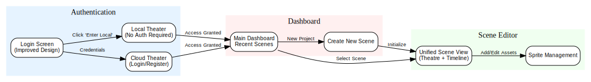

# UI Walkthrough: Project Update

**Date:** 2026-01-09
**Author:** Chacker (AI Team)

We've been hard at work refining the Papeterie Engine's user experience and solidifying the underlying architecture. This update highlights the latest visual improvements to the login flow, the current state of the dashboard, and outlines our next steps.

## Visual Improvements: Login Screen

We received feedback that the login screen felt "crowded," particularly in the Cloud Theater authentication pane. To address this, we've significantly increased the breathing room around the login form, giving the design a more open and premium feel.

## Current Application State

The Papeterie Engine is maturing into a robust platform for 2D toy theatre animation.

### Main Dashboard
The dashboard now serves as the central hub for managing your creative projects. From here, you can access your local library or connect to the cloud.

### Unified Scene Editor
The heart of the application is the Unified Scene Editor. It seamlessly combines the Theatre stage with the Timeline, allowing for intuitive sprite manipulation and animation sequencing.

## User Journey Overview

The following diagram illustrates the current high-level user flow through the application, from authentication to creativity.

*[Source DOT file](../../assets/diagrams/user_journey_2026_01_09.dot)*

## Next Steps

With the UI foundation solidifying, we are turning our attention to the following key areas from our backlog:

1.  **Export Scene to Movie File**: Enabling users to share their creations as MP4 or GIF files.
2.  **Undo/Redo System**: Implementing a robust command pattern to forgive creative mistakes.
3.  **Sprite Remixing**: allowing users to iterate on existing sprites by modifying their generative prompts.
4.  **Security Hardening**: Continuing our security review to ensure safe asset handling and authentication.

We are excited to continue building the future of digital toy theatre!
