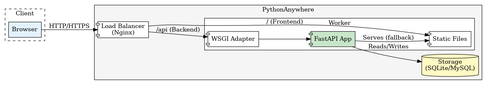

# Deployment Design: PythonAnywhere

This document outlines the architecture and design decisions for deploying the Papeterie Engine to PythonAnywhere.

## Context

The Papeterie Engine is currently a local-first application. To enable wider access and easier sharing, we are moving towards a cloud-hosted deployment on PythonAnywhere. This platform was chosen for its strong Python support and ease of use for small-scale applications.

## Architecture

## Deployment Strategy

We utilize a **Lightweight Deployment** strategy for PythonAnywhere:
*   **Core-Only Dependencies**: Heavy libraries (`numpy`, `opencv`, `scipy`) are excluded to fit within the strict 512MB/1GB disk quotas of lower tiers.
*   **Automated Setup**: Custom scripts (`setup_pythonAnywhere.py`) standardize the environment configuration.

For detailed deployment instructions, see [`docs/HOWTO_Deploy_PythonAnywhere.md`](../HOWTO_Deploy_PythonAnywhere.md).

## Architecture

The deployment consists of three main components:
1.  **Frontend (React/Vite)**: Built as static assets (HTML/CSS/JS) and uploaded to the server.
2.  **Backend (FastAPI)**: Running as a WSGI application via `a2wsgi`.
3.  **Database (SQLite)**: Persistent storage for scenes and sprites.

*(Source: [deployment.dot](../assets/diagrams/deployment.dot))*

### Key Decisions

#### 1. Hybrid SPA Serving Strategy
PythonAnywhere's "Static Files" mapping does not support SPA rewrite rules. We use a hybrid approach:
-   **Static Mapping**: `/assets` and `/ui_assets` are served by Nginx for speed.
-   **SPA Fallback**: FastAPI serves `index.html` for any unknown routes, ensuring client-side routing works.

#### 2. Environment Variables
Secrets are managed via a `.env` file. The setup script configures the WSGI entry point to load this file on startup, preventing the need to manually configure secrets in the PythonAnywhere dashboard.

## Challenges & Mitigations

| Challenge | Mitigation |
| :--- | :--- |
| **WSGI Compatibility** | `a2wsgi` adapter bridges FastAPI (ASGI) to WSGI. |
| **Disk Quota** | "Lightweight" deployment tier excludes heavy image processing libs. |
| **Static Build** | Local build script `prepare_deploy.sh` ensures assets are ready before upload. |

