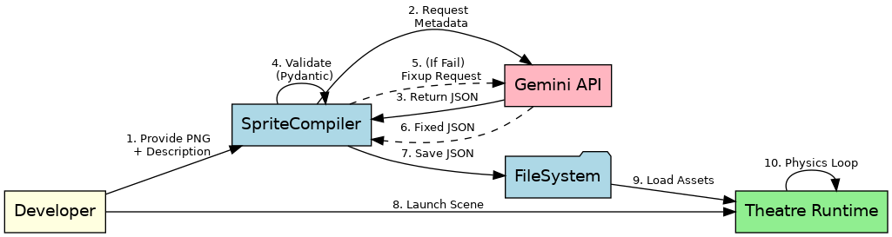
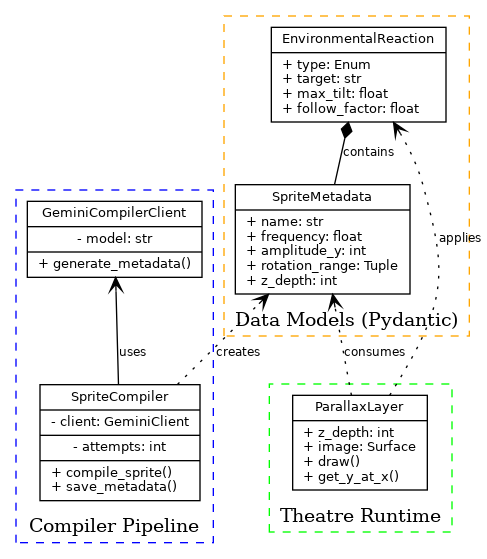
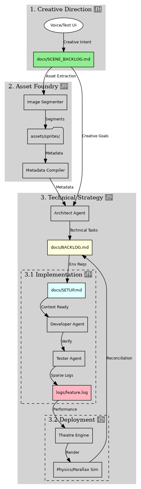

This design document outlines the architecture for the **Papeterie Engine**, a 2D "Toy Theatre" animation system that uses AI-processed metadata to animate hand-drawn layers with realistic physics-based environmental reactions.

---

## 🎭 Papeterie Engine: System Design

### 1. Architectural Overview

The system is divided into two primary domains: the **Compiler Pipeline**, which handles AI-driven asset preparation, and the **Theatre Runtime**, which executes the parallax rendering and physics simulations.

* **Compiler Pipeline:** Uses Gemin to transform natural language descriptions into structured `SpriteMetadata` and `SceneConfig`.
* **Validation Layer:** Employs Pydantic models in `models.py` to enforce strict schema adherence and physical constraints.
* **Theatre Runtime:** A `pygame`-based engine (backend) and a React-based engine (frontend) that handle parallax scrolling, oscillations, and environmental reactions.

---

### 2. Core Components

#### A. Data Models (`models.py`)

The engine is "Schema-First," using Pydantic to ensure all data moving through the system is valid.

* **`SpriteMetadata`**: Defines the intrinsic properties of an asset (z-depth, behaviors).
* **`SceneConfig`**: The master manifest for a scene, acting as the "Stage Script."
* **`BehaviorConfig`**: A modular system for defining animations (Oscillate, Drift, Pulse, etc.).

#### B. The Compiler (`engine.py` & `gemini_client.py`)

The `SpriteCompiler` orchestrates the relationship between the developer and the LLM via a specialized two-stage pipeline.

* **Two-Stage LLM Pipeline**:
    1. **Descriptive Analysis**: Gemini 2.5-Flash analyzes raw sprites and scenes to generate a natural language description of their intended "vibe" and motion.
    2. **Structured Generation**: Gemini 3 Pro translates these descriptions into rigid `JSON` metadata that conforms to the Pydantic models.
* **The Fixup Loop**: If the LLM returns malformed JSON or invalid physics, the engine automatically triggers a `MetaFixupPrompt` to repair the data.

#### C. The Theatre (`theatre.py` & `Theatre.js`)

The runtime engine translates static metadata into dynamic movement.

* **Parallax Logic**: Layers are sorted by `z_depth`. Scrolling speeds are calculated based on these depths to create an illusion of 3D space.
* **Pivot-on-Crest Algorithm**: This physics routine samples the Y-position of a target "environment" layer (like a wave) at two points (ahead and behind the sprite) to determine the appropriate rotation (tilt).

---

### 3. Data Flow


> [Source (DOT)](../assets/diagrams/data_flow.dot)

---

### 4. User-Scoped Asset Management

Assets are isolated per user to ensure privacy and security, moving away from a flat global asset structure.

*   **Directory Structure**:
    ```text
    assets/users/<user_id>/
    ├── sprites/  # User-specific sprites (.png, .prompt, .prompt.json)
    └── scenes/   # User-specific scene configurations (.json)
    ```
*   **Asset Isolation**: The backend routers enforce `user_id` checks to ensure users only access and modify their own creative work.

---

### 5. Asset Logging & Status Tracking

The `AssetLogger` tracks the progression of an asset through its lifecycle, providing real-time feedback to the user.

*   **Status Transitions**:
    1. **Importing**: File is uploaded to the server.
    2. **Optimizing**: The Two-Stage LLM Pipeline is processing the asset.
    3. **Ready**: Metadata is generated and the asset is ready for the theatre.
*   **Telemetry**: Logs are stored per asset and user, allowing the frontend to display progress bars and status indicators.

---

### 6. Technical Constraints & Rules

*   **Asset Integrity**: All image processing must maintain **RGBA alpha transparency**.
*   **Environment**: Built for **Python 3.10+** using `uv` and **Node.js 20+**.
*   **Governance**: All changes must pass `scripts/validate.sh` and occur on feature branches.

---

### 7. Token Usage & Cost Tracking

*   **Persistence**: All token counts are recorded in `logs/token_ledger.csv`.
*   **Transparency**: Each entry includes a timestamp, the task name, and the specific model used.

---

### **8. Class Relationships (PlantUML)**



---

### **9. System Architecture (Dual-Backlog)**


*(Source: [system_architecture.dot](../assets/diagrams/system_architecture.dot))*
