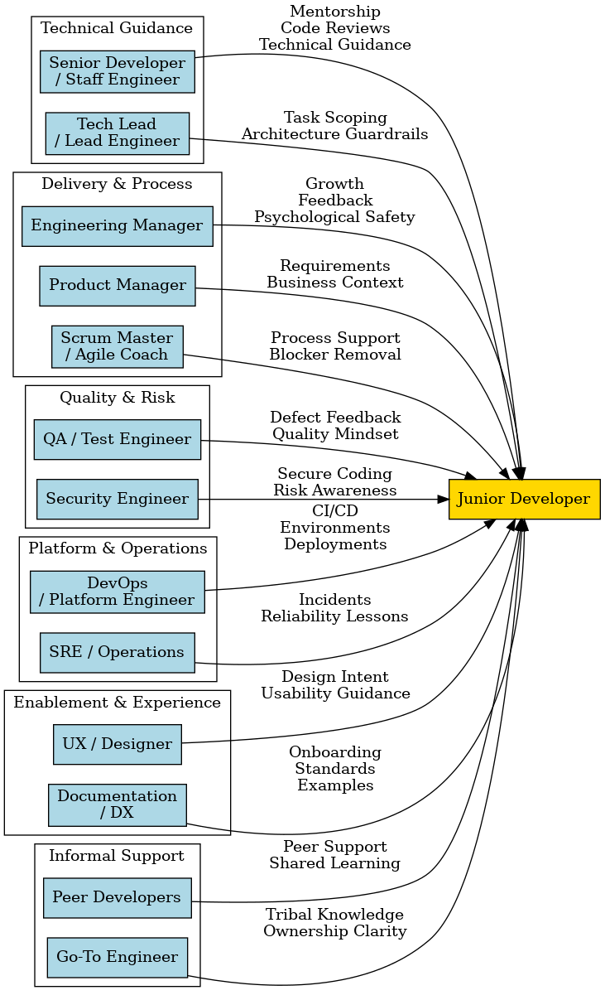

# Junior Developer Support Ecosystem

This document outlines the various roles and relationships that support a Junior Developer within the Papeterie Engine development lifecycle. It captures both formal technical guidance and informal peer support structures required to ensure smooth onboarding and continuous growth.

## Overview

The ecosystem is designed to provide comprehensive coverage across technical, process, quality, and platform domains. By understanding these touchpoints, a Junior Developer can effectively navigate the project and leverage the expertise of the wider team.

## Ecosystem Diagram

[Source Diagram (.dot)](../assets/diagrams/junior_dev_ecosystem.dot)

## Key Roles

- **Senior Developers / Staff Engineers**: Provide high-level technical guidance, mentorship, and detailed code reviews.
- **Tech Leads**: Help with task scoping and provide architectural guardrails.
- **Engineering Managers**: Focus on growth, feedback, and psychological safety.
- **Product Managers**: provide requirements and business context for the features.
- **QA / Test Engineers**: Provide feedback on quality and help cultivate a quality-first mindset.
- **DevOps / Platform Engineers**: Support CI/CD pipelines, environments, and deployments.
- **Peer Developers**: Offer informal support and shared learning opportunities.