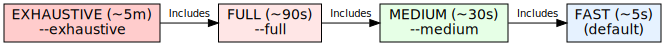
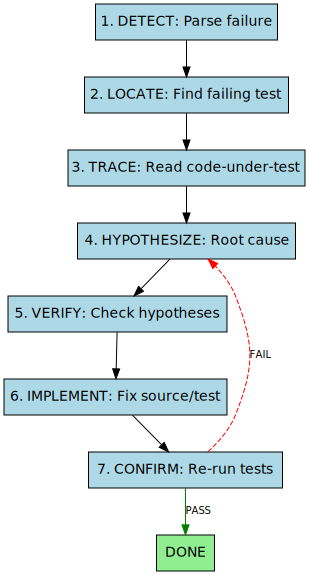

# Verification Process

This document outlines the verification and testing strategies for the Papeterie Engine.

> **📖 Deep-Dive**: For the full QA reasoning loop and agentic workflow catalog, see the [consolidated blogs](../blogs/).

## Overview

We employ a comprehensive testing strategy covering both the Python backend (Compiler/Renderer) and the React frontend.


The primary entry point for validation is a tier-based script:

```bash
./scripts/validate.sh              # Fast: LOC-only (~5s)
./scripts/validate.sh --medium     # Medium: file-level (~30s)
./scripts/validate.sh --full       # Full: all tests + E2E (~90s)
./scripts/validate.sh --exhaustive # Exhaustive: max coverage (~5m)
./scripts/validate.sh --help       # Show all options
```

**Workflow Tiers**:


*[Source: tiered_validation.dot](../assets/diagrams/tiered_validation.dot)*

- **Fast** (default): LOC-only tests via `pytest-testmon` and custom JS locator.
- **Medium**: File-level coverage, auto-fix linting.
- **Full**: All tests + E2E + coverage.
- **Exhaustive**: Parallel execution, maximum coverage.

## Backend Verification

The backend (`src/compiler`, `src/renderer`, `src/server`) is tested using `pytest`.

- **Command**: `uv run pytest --cov=src --cov-report=term-missing`
- **Location**: `tests/`
- **Frameworks**: `pytest`, `pytest-asyncio`, `pytest-mock`, `pytest-cov`

### Coverage limits
We aim for high coverage in core logic (`compiler/engine.py`, `renderer/theatre.py`).

## Frontend Verification

The web dashboard (`src/web`) is tested using `vitest`.

- **Command**: `npm run test:coverage` (in `src/web`)
- **Location**: `src/web/src/**/__tests__`
- **Frameworks**: `vitest`, `react-testing-library`, `@vitest/coverage-v8`

## Test Impact Analysis (Smart Testing)

To optimize verification time, we support "Smart Testing" to run only tests affected by code changes.

### Backend (Python)
We use `pytest-testmon` to track dependencies between tests and code.

- **Setup**: `uv run pytest --testmon` (First run builds the dependency database)
- **Run Impacted**: `uv run pytest --testmon --testmon-forceselect`
- **Principles**:
    - `testmon` monitors which lines of code are executed by each test.
    - When code changes, it selects only the tests that cover the changed lines.
    - If `testmon` database is missing or out of sync, it falls back to running all tests.

### Frontend (React)
We leverage Vitest's built-in related/changed logic plus custom LOC tracking.

- **File-level**: `npm run test -- --changed` (tests for modified files)
- **LOC-level**: Uses `.vitest-loc-map.json` to select tests covering specific changed lines
- **Principles**:
    - Default mode runs tests for files that have been modified since the last commit.
    - `--changeset_only` mode uses the LOC map for tighter selection.

### Automation
Smart testing is integrated into the unified `validate.sh` tiered system:
```bash
./scripts/validate.sh --fast       # LOC-only via testmon (~5s)
./scripts/validate.sh --medium     # File-level coverage (~30s)
./scripts/validate.sh --full       # All tests + E2E (~90s)
./scripts/validate.sh --exhaustive # Max coverage, parallel (~5m)
```

### Summary Output
The script produces a structured summary:
```
=== VALIDATION SUMMARY ===
Tier:        Full (all tests)
Backend:     ✓ 140 passed, 2 skipped (51s)
Frontend:    ✓ 227 passed (5s)
E2E:         ✓ 9 passed (25s)
Total Time:  84s
```

## QA Reasoning Loop

When validation fails, the agent follows a structured chain-of-thought to identify and fix the root cause.


*[Source: qa_reasoning_loop.dot](../assets/diagrams/qa_reasoning_loop.dot)*


## Verification Backlog

Improvements planned for the verification system:

- [x] **End-to-End (E2E) Testing**: Implemented via Playwright with 10 tests covering smoke tests, timeline markers, UX consistency, and theme switching.
- [ ] **Visual Regression Testing**: Automatically compare rendered output frames against "known good" baselines to detect rendering regressions.
- [ ] **Snapshot Testing**: Use Vitest snapshots for React components to catch unexpected UI changes.
- [ ] **CI Integration**: Set up GitHub Actions to run `validate.sh` on PRs.

## Current Coverage (as of Jan 2026)

| Area | Coverage |
|------|----------|
| **Backend (Python)** | 83% |
| **Frontend (React)** | 59% |
| **E2E (Playwright)** | 35% |
| **Total** | 71% |

### Recent Improvements
- Full ESLint cleanup: reduced 229 errors to 0
- Fixed hooks rules violation in `DeleteConfirmationDialog.jsx`
- Added missing ignores for `.vite`, `node_modules`, `coverage` directories
- Disabled `react-hooks/set-state-in-effect` rule (intentional reset patterns)
- Added tests for `AudioManager.js` (21% → 52%)
- Added tests for `BehaviorEditor.jsx` (0% → 56%)
- Added tests for `TimelineEditor.jsx` (0% → 43%)
- Added tests for `sounds.py` router (44% → 100%)

