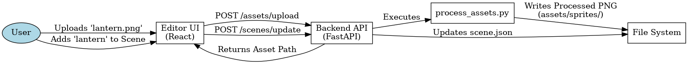

# Papeterie Editor - Architecture & Automation Plan

## Overview
The "Papeterie Editor" will be a web-based UI that allows users to:
1.  **Manage Scenes**: Create, edit, and organize scenes.
2.  **Import Assets**: Upload raw images that are automatically processed (green-screen removal, etc.).
3.  **Compile Sprites**: Write natural language prompts and compile them into physics metadata.
4.  **Preview**: See real-time or near-real-time previews of the animation.

## 1. Asset Pipeline Automation
To support the UI, the asset processing script (`scripts/process_assets.py`) must be generic and callable programmatically.

### Refactoring `process_assets.py`
We will convert it into a CLI tool with the following signature:
```bash
python scripts/process_assets.py --src <path/to/raw/image.png> --dest <asset_name> --mode [transparent|copy]
```
- **Trigger**: The backend API will call this script whenever a user uploads a file.
- **Watcher**: Optionally, a file watcher can invoke this script when files land in a "raw" folder.

## 2. Technology Stack

### Backend (Python)
- **Framework**: `FastAPI` (lightweight, async, auto-docs).
- **Responsibilities**:
    - **API Layer**: Endpoints to read/write `scene.json` and `.prompt.json` files.
    - **Orchestrator**: Subprocess calls to `Theatre` (preview) and `process_assets.py`.
    - **Gemini Client**: Integration for the LLM compiler.

### Frontend (React/Vite)
- **Framework**: React + Vite + TypeScript.
- **Styling**: Vanilla CSS (per user preference for "Rich Aesthetics" / "Premium").
- **State Management**: React Query (for syncing with backend JSON).
- **Components**:
    - **AssetDetailLayout**: Shared UI shell for Scene and Sprite details, ensuring consistent UX (Header, Stepper, Logs).
    - **Controllers**: `SpriteDetailView` and `SceneDetailView` process data and render into the shared layout.
    - **Shared UI**: `Icon` (Lucide), `StatusStepper` (Lifecycle visualization).
    - **Logging**: `LogPanel` integrates real-time server logs via `/api/logs` endpoints.

## 3. Communication Flow

> [Source (DOT)](assets/diagrams/frontend_architecture_flow.dot)

## 4. Next Steps
1.  **Refactor**: Make `process_assets.py` generic.
2.  **Scaffold**: Initialize `src/server` (FastAPI) and `ui/` (React).
3.  **Prototype**: Build a simple "Upload & Process" flow.
