This design document outlines the architecture for the **Papeterie Engine**, a 2D "Toy Theatre" animation system that uses AI-processed metadata to animate hand-drawn layers with realistic physics-based environmental reactions.

---

## 🎭 Papeterie Engine: System Design

### 1. Architectural Overview

The system is divided into two primary domains: the **Compiler Pipeline**, which handles AI-driven asset preparation, and the **Theatre Runtime**, which executes the parallax rendering and physics simulations.

* **Compiler Pipeline:** Uses `GeminiCompilerClient` to transform natural language descriptions into structured `SpriteMetadata`.
* **Validation Layer:** Employs Pydantic models in `models.py` to enforce strict schema adherence and physical constraints.
* **Theatre Runtime:** A `pygame`-based engine that handles parallax scrolling, "bobbing" oscillations, and complex environmental reactions like wave-tilting.

---

### 2. Core Components

#### A. Data Models (`models.py`)

The engine is "Schema-First," using Pydantic to ensure all data moving through the system is valid.

* **`SpriteMetadata`**: Defines the intrinsic properties of an asset (z-depth, heave amplitude, oscillation frequency).
* **`EnvironmentalReaction`**: A specialized sub-model defining how a sprite interacts with other layers (e.g., a boat reacting to a "wave" layer).
* **`SceneConfig`**: The master manifest for a scene, acting as the "Stage Script."

#### B. The Compiler (`engine.py` & `gemini_client.py`)

The `SpriteCompiler` orchestrates the relationship between the developer and the LLM.

* **Prompt Management**: Loads system templates (`MetaPrompt.prompt`) to guide the LLM's creativity within physical bounds.
* **The Fixup Loop**: If the LLM returns malformed JSON or invalid physics (e.g., a boat tilting 360 degrees), the engine automatically triggers a `MetaFixupPrompt` to repair the data.

#### C. The Theatre (`theatre.py`)

The runtime engine translates static metadata into dynamic movement.

* **Parallax Logic**: Layers are sorted by `z_depth`. Scrolling speeds are calculated based on these depths to create an illusion of 3D space.
* **Pivot-on-Crest Algorithm**: This physics routine samples the Y-position of a target "environment" layer (like a wave) at two points (ahead and behind the sprite). It calculates the slope () to determine the appropriate rotation (tilt) for the sprite.

---

### 3. Data Flow

```plantuml
@startuml
!option hand_written true
participant "Developer" as Dev
participant "SpriteCompiler" as SC
participant "Gemini API" as AI
participant "FileSystem" as FS
participant "Theatre Runtime" as TR

Dev -> SC: Provide .png + Description
SC -> AI: Request Metadata (JSON)
AI -> SC: Return Raw JSON
SC -> SC: Validate (Pydantic)
alt Validation Fails
    SC -> AI: Request Fixup
    AI -> SC: Return Fixed JSON
end
SC -> FS: Save <name>.prompt.json
Dev -> TR: Launch Scene
FS -> TR: Load Metadata & Assets
TR -> TR: Execute Parallax & Physics Loop
@enduml

```

---

### 4. Technical Constraints & Rules

As defined in the governance instructions:

* **Asset Integrity**: All image processing must maintain **RGBA alpha transparency** to preserve the hand-drawn "paper-cut" aesthetic.
* **Scaling**: Rendering supports both fixed `target_height` and relative `height_scale` to adapt to different screen resolutions.
* **Environment**: Built for **Python 3.10+** using `uv` for dependency management and `MoviePy` for eventual video export.

---

### **Papeterie Engine: Technical Architecture Design**

This document details the class relationships and system interactions for the Papeterie Engine. The architecture is designed to bridge the gap between creative "vibe coding" (using LLM-generated metadata) and rigid physics-based rendering.

---

### **1. Class Relationships (PlantUML)**

The following diagram illustrates how the `SpriteCompiler` acts as the bridge between external intelligence and the internal data models, which are then consumed by the `ParallaxLayer` for real-time rendering.


---

### **2. Component Documentation**

#### **A. The Compiler Architecture**

* **The Orchestrator**: `SpriteCompiler` manages the lifecycle of an asset, from raw PNG to a structured `.prompt.json` file.
* **Recursive Fixup Loop**: To mitigate LLM "hallucinations" or malformed JSON, the compiler implements a recursive `_validate_and_fix` method that feeds error messages back into the `GeminiCompilerClient` for up to two attempts.
* **Metadata Validation**: The engine uses `SpriteMetadata` (Pydantic) to ensure parameters like `frequency` (0.1–2.0 Hz) and `z_depth` (1–10) remain within safe bounds for the renderer.

#### **B. The Physics Layer (`theatre.py`)**

* **Environmental Sampling**: The `ParallaxLayer` provides a `get_y_at_x` method, allowing other layers to "probe" its current height. This is essential for layers that need to follow a wave or a shifting floor.
* **Pivot-on-Crest Logic**: In the `draw` method, if a `PIVOT_ON_CREST` reaction is active, the engine calculates the slope between two sample points on the target layer.
* **Tilt Calculation**: The final tilt angle is calculated using , then scaled and clamped to the `max_tilt_angle` defined in the metadata.

#### **C. Configuration & Scene Management**

* **Scene Overrides**: While `SpriteMetadata` defines the default physics of a paper asset, `SceneLayer` allows for scene-specific overrides (like changing the `scroll_speed` or `opacity` for a specific sequence).
* **Dynamic Reloading**: The `run_theatre` loop monitors the `scene1.json` file’s modification time, enabling "live-coding" where changes to the JSON are reflected instantly in the Pygame window.

Would you like me to expand the **EnvironmentalReaction** model to include more complex behaviors, such as "buoyancy" or "wind resistance"?

---

This is a sophisticated mental model that blends **Creative AI (Generative)** with **Agentic AI (Software Engineering)**. You are essentially proposing a "Self-Correcting Creative Pipeline" where the architecture isn't just a static stack, but a feedback loop between artistic intent and technical execution.

The concept of tracking feature work in **tokens** is a particularly insightful "Senior Architect" approach to managing the modern cost of compute as a project resource.

---

## 🏗️ High-Level Architectural Review

### **The Strengths**

* **Separation of Concerns**: Splitting the "Asset Creator" (Art-to-Sprites) from the "System Integrator" (Integration & Debugging) allows for specialized prompts and models for each task.
* **Human-in-the-Loop (HITL)**: You correctly identified the current LLM limitation regarding **alpha transparency**. While models like Segment Anything (SAM) are improving, manual "finesse" in GIMP is still required for the high-fidelity "Toy Theatre" look you are after.
* **Sparse Text Logs**: This is a great way to manage LLM context windows. By only logging at "inflections" (state changes or errors), you keep the "Agent Tester" from being overwhelmed by noise.

### **Identified Gaps**

1. **State Persistence**: Between the "Asset MCP" and the "Runtime MCP," you need a **Source of Truth**. Your `SpriteMetadata` and `SceneConfig` models currently act as this bridge, but they need a versioned database or registry.
2. **The "Vibe" Translation Layer**: Voice and text inputs are high-level. You need a specialized **Compiler** (which you've started in `engine.py`) to translate "make it feel like a stormy night" into specific `amplitude_y` and `frequency` values.
3. **Token Budgeting Layer**: If features are tracked in tokens, the stack needs a middleware that estimates and "quotes" the token cost before an agent begins a complex debugging or refactoring task.

---

## **The Papeterie Stack: Dual-Backlog Architecture**

```plantuml
@startuml
skinparam backgroundColor #fdfdfd
skinparam ArrowColor #2D2D2D
skinparam DefaultFontName "Verdana"
skinparam linetype ortho

' Layer 1: The Artist Agent (Creative Direction)
package "1. Creative Direction (The Artist) 🎭" {
    [Voice/Text UI] as UI
    file "docs/SCENE_BACKLOG.md" as SceneLog #lightgreen
    note bottom of SceneLog
      <b>Ownership:</b> Artist Agent
      <b>Content:</b> World-building, 
      Layer Narrative, Aesthetic Goals
    end note
}

' Layer 2: Creative MCP & Asset Extraction
package "2. Asset Foundry (Creative MCP) 🎨" {
    [Image Segmenter] as IS
    [Metadata Compiler] as MC
    folder "assets/sprites/" as Assets
}

' Layer 3: The Architect MCP (System Strategy)
package "3. Technical Strategy (Architect MCP) 🏛️" {
    [Architect Agent] as Arch
    file "docs/BACKLOG.md" as Backlog #lightyellow
    note bottom of Backlog
      <b>Ownership:</b> Architect
      <b>Content:</b> Engineering Tasks,
      Token/Hour Ledger, Feature Roadmap
    end note

    ' Layer 3.1: Developer & Tester (Implementation)
    package "3.1. Implementation (Dev & Test) 💻" {
        file "docs/SETUP.md" as Setup #lightcyan
        [Developer Agent] as Dev
        [Tester Agent] as Test
        file "logs/<feature>.log" as Results #lightpink
    }

    ' Layer 3.2: Runtime Engine
    package "3.2. Deployment (The Theatre) 📽️" {
        [Theatre Engine] as TE
        [Physics/Parallax Sim] as PS
    }

}

' Strictly Top-to-Bottom Flows with Artifact Arrows
UI -down-> SceneLog : "Creative Intent"
SceneLog -down-> IS : "Asset Extraction Tasks"
IS -down-> Assets : "Segmented Layers (HITL)"
Assets -down-> MC : "Generate Metadata"

MC -down-> Backlog : "Technical Integration Needed"
Backlog -down-> Arch : "Refine Feature Scope"
Arch --> Setup : "Env Requirements"

Setup -down-> Dev : "Context Ready"
Dev -down-> Test : "Submit for Verification"
Test -down-> Results : "Sparse Inflection Logs"

Results -down-> TE : "Validated Performance"
TE -down-> PS : "Final Render"
PS --> Backlog : "Token/Hour Reconciliation"

@enduml

```



### **Detailed Artifact & Ownership Summary**

* **`docs/SCENE_BACKLOG.md`** 🎭: Owned by the **Artist Agent**. It tracks the "Vibe" and the narrative progression. This backlog triggers the **Creative MCP** to perform the heavy lifting of image segmentation and initial metadata compilation.
* **`docs/BACKLOG.md`** 🏛️: Managed by the **Architect Agent** behind its own MCP. It transforms the output of the Creative MCP into engineering tasks—such as implementing `PIVOT_ON_CREST` physics or containerizing the stack—and tracks the **Token/Hour budget**.
* **`docs/SETUP.md`** 💻: Maintained by the **Developer and Tester** as a living contract for the environment (Python 3.10+, `uv`, `pygame`). It ensures the project remains "portable" for cloud moves.
* **`logs/<feature_name>.log`** 🧪: The **Tester**'s output for the Architect. These "Sparse Logs" only capture "Inflection Points" (e.g., a boat rotation exceeding `max_tilt_angle`), allowing the Architect and Developer to debug without exhausting their token quota.

### **The Token Pipeline**

By splitting the backlogs, you can now allocate separate **Token Quotas** for "Creativity" (Artist/Creative MCP) and "Engineering" (Architect/Dev/Tester). If the Creative MCP burns too many tokens trying to segment a complex GIMP file, the Architect can prioritize technical debt or optimization tasks in the engineering backlog to balance the overall project "burn rate".

**Would you like me to draft the "Initial Handover" prompt for the Architect MCP to take the compiled `SpriteMetadata` from the Creative MCP and generate the first technical task in `BACKLOG.md`?**

```plantuml
@startuml
skinparam backgroundColor #fdfdfd
skinparam ArrowColor #2D2D2D
skinparam DefaultFontName "Verdana"
skinparam linetype ortho
skinparam shadowing false

' Layer 1: The Artist Agent (Creative Direction)
package "1. Creative Direction (The Artist) 🎭" {
    [Voice/Text UI] as UI
    file "docs/SCENE_BACKLOG.md" as SceneLog #lightgreen
}

' Layer 2: Creative MCP & Asset Extraction
package "2. Asset Foundry (Creative MCP) 🎨" {
    [Image Segmenter] as IS
    [Metadata Compiler] as MC
    folder "assets/sprites/" as Assets
}

' Layer 3: The Architect MCP (System Strategy)
package "3. Technical Strategy (Architect MCP) 🏛️" {
    [Architect Agent] as Arch
    file "docs/BACKLOG.md" as Backlog #lightyellow

    ' Layer 3.1: Developer & Tester (Implementation)
    package "3.1. Implementation (Dev & Test) 💻" {
        file "docs/SETUP.md" as Setup #lightcyan
        [Developer Agent] as Dev
        [Tester Agent] as Test
        file "logs/<feature>.log" as Results #lightpink
    }

    ' Layer 3.2: Runtime Engine
    package "3.2. Deployment (The Theatre) 📽️" {
        [Theatre Engine] as TE
        [Physics/Parallax Sim] as PS
    }
}

' --- Strictly Top-to-Bottom Flows ---

' Artist establishes the vibe
UI -down-> SceneLog : "Creative\nIntent"
SceneLog -down-> IS : "Asset\nExtraction"
IS -down-> Assets : "Segmented\nLayers"
Assets -down-> MC : "Generate\nMetadata"

' Architect consumes inputs from both Artist and Asset Foundry
SceneLog -down-> Arch : "Read Vibe\nCreative Goals"
MC -up-> Arch : "Receive\nSprite\nMetadata"

' Architect is the sole writer of the engineering Backlog
Arch -down-> Backlog : "Output\nTechnical\nTasks"

' Engineering implementation follows the Backlog
Backlog -down-> Setup : "Apply Env\nRequirements"
Setup -down-> Dev : "Context\nReady"
Dev -down-> Test : "Submit for\nVerification"
Test -down-> Results : "Sparse\nInflection\nLogs"

' Runtime Performance
Results -down-> TE : "Validated\nPerformance"
TE -down-> PS : "Final\nRender"

' Feedback loop back to the Architect's ledger
PS -right-> Backlog : "Token/Hour\nReconciliation"
@enduml
```

```plantuml
@startuml
skinparam backgroundColor #fdfdfd
skinparam ArrowColor #2D2D2D
skinparam DefaultFontName "Verdana"
skinparam linetype ortho
skinparam shadowing false

' --- LAYER 1: ARTIST ---
package "1. Creative Direction (The Artist) 🎭" {
    [Voice/Text UI] as UI
    file "docs/SCENE_BACKLOG.md" as SceneLog #lightgreen
    note right of SceneLog : <b>Ownership:</b> Artist Agent\n<b>Content:</b> World-building,\nNarrative, Aesthetic Goals
}

' --- LAYER 2: ASSET FOUNDRY ---
package "2. Asset Foundry (Creative MCP) 🎨" {
    [Image Segmenter] as IS
    [Metadata Compiler] as MC
    folder "assets/sprites/" as Assets
}

' --- LAYER 3: ARCHITECT ---
package "3. Technical Strategy (Architect MCP) 🏛️" {
    [Architect Agent] as Arch
    file "docs/BACKLOG.md" as Backlog #lightyellow
    note right of Backlog : <b>Ownership:</b> Architect\n<b>Content:</b> Engineering Tasks,\nToken/Hour Ledger

    ' Sub-Package: Implementation
    package "3.1. Implementation (Dev & Test) 💻" {
        file "docs/SETUP.md" as Setup #lightcyan
        [Developer Agent] as Dev
        [Tester Agent] as Test
        file "logs/<feature>.log" as Results #lightpink
    }

    ' Sub-Package: Deployment
    package "3.2. Deployment (The Theatre) 📽️" {
        [Theatre Engine] as TE
        [Physics/Parallax Sim] as PS
    }
}

' --- FLOWS ---

' Artist Flow
UI -down-> SceneLog : "Creative\nIntent"
SceneLog -down-> IS : "Asset\nExtraction"
IS -down-> Assets : "Layers\n(HITL)"
Assets --> MC : "Generate\nMetadata"

' Architect Integration (Central Junction)
SceneLog -down-> Arch : "Read Creative\nGoals"
MC --> Arch : "Receive Sprite\nMetadata"
Arch -down-> Backlog : "Output Technical\nTasks"

' Dev/Test Flow
Backlog -down-> Setup : "Env\nReqs"
Setup -down-> Dev : "Context\nReady"
Dev -down-> Test : "Submit\nVerify"
Test -down-> Results : "Sparse\nLogs"

' Execution
Results -left-> TE : "Validated\nPerformance"
TE -down-> PS : "Final\nRender"
PS -right-> Backlog : "Token/Hour\nReconciliation"

@enduml
```




