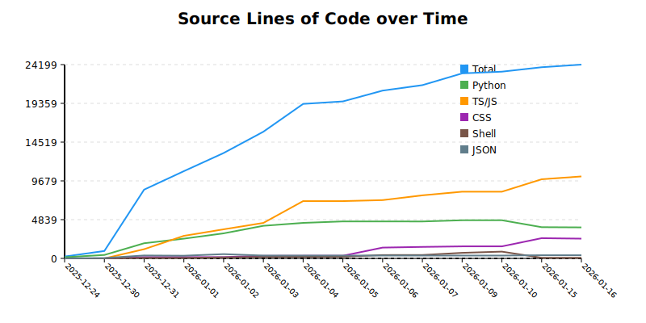
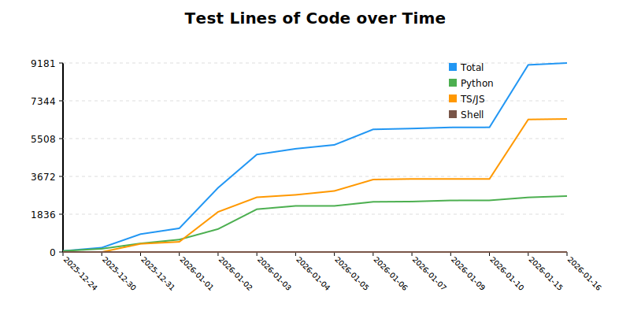
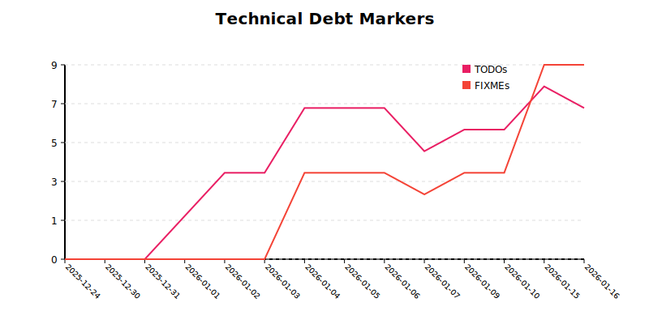

# Project History Analysis
Generated on 2026-01-16T16:47:00.855558
## Summary
- **Analysis Period**: 2025-12-24 to 2026-01-16 (23 days)
- **Total Growth**: +23,964 LOC
- **Avg Metrics**: +1041.91 Lines/Day

## Source Code Growth

## Test Code Growth

## Technical Debt

## Commit History

| Date | Commit | Author | Total LOC | Py LOC | TS/JS LOC | MD LOC | CSS LOC | SH LOC | JSON LOC | Tests | TODOs | NEEDS_FIX |
|---|---|---|---|---|---|---|---|---|---|---|---|---|
| 2026-01-16 | `4fd5abf` | CharlesJ Hacker | 24199 | 3872 | 10236 | 2108 | 2467 | 82 | 399 | 76 | 7 | 9 |
| 2026-01-16 | `3e70bfa` | CharlesJ Hacker | 24107 | 3855 | 10154 | 2105 | 2477 | 82 | 399 | 76 | 8 | 9 |
| 2026-01-16 | `7ae8c8b` | CharlesJ Hacker | 24100 | 3900 | 10112 | 2096 | 2476 | 82 | 399 | 76 | 8 | 9 |
| 2026-01-16 | `df84ea5` | CharlesJ Hacker | 23996 | 3900 | 10112 | 2091 | 2377 | 82 | 399 | 76 | 8 | 9 |
| 2026-01-16 | `cf89689` | CharlesJ Hacker | 23973 | 3900 | 10108 | 2048 | 2401 | 82 | 399 | 76 | 8 | 9 |
| 2026-01-15 | `1c46415` | CharlesJ Hacker | 23871 | 3900 | 9883 | 2046 | 2526 | 82 | 399 | 75 | 8 | 9 |
| 2026-01-10 | `a977a72` | CharlesJ Hacker | 23317 | 4766 | 8330 | 2552 | 1503 | 846 | 356 | 51 | 6 | 4 |
| 2026-01-09 | `c0febb4` | CharlesJ Hacker | 23104 | 4763 | 8330 | 2492 | 1503 | 696 | 356 | 51 | 6 | 4 |
| 2026-01-09 | `7770348` | CharlesJ Hacker | 23102 | 4763 | 8330 | 2490 | 1503 | 696 | 356 | 51 | 6 | 4 |
| 2026-01-09 | `5e7eb28` | CharlesJ Hacker | 23026 | 4763 | 8330 | 2414 | 1503 | 696 | 356 | 51 | 5 | 3 |
| 2026-01-09 | `8c8c386` | CharlesJ Hacker | 22723 | 4613 | 8297 | 2412 | 1453 | 628 | 356 | 51 | 5 | 3 |
| 2026-01-09 | `e09c42b` | CharlesJ Hacker | 22284 | 4613 | 8294 | 1983 | 1453 | 621 | 356 | 51 | 5 | 3 |
| 2026-01-09 | `1da56a0` | CharlesJ Hacker | 21767 | 4613 | 7989 | 1967 | 1453 | 425 | 356 | 51 | 5 | 3 |
| 2026-01-07 | `5b93b5c` | CharlesJ Hacker | 21635 | 4613 | 7875 | 1967 | 1435 | 425 | 356 | 51 | 5 | 3 |
| 2026-01-06 | `9f3676f` | CharlesJ Hacker | 20953 | 4618 | 7279 | 1967 | 1350 | 419 | 356 | 51 | 7 | 4 |
| 2026-01-06 | `8b555d4` | CharlesJ Hacker | 20468 | 4618 | 6817 | 1967 | 1327 | 419 | 356 | 50 | 7 | 4 |
| 2026-01-05 | `32c6898` | CharlesJ Hacker | 19602 | 4620 | 7154 | 1959 | 333 | 216 | 356 | 43 | 7 | 4 |
| 2026-01-05 | `9b05fd8` | CharlesJ Hacker | 19342 | 4476 | 7154 | 1859 | 333 | 200 | 356 | 42 | 7 | 4 |
| 2026-01-04 | `221a135` | CharlesJ Hacker | 19291 | 4435 | 7155 | 1848 | 333 | 200 | 356 | 42 | 7 | 4 |
| 2026-01-04 | `b8eb09f` | CharlesJ Hacker | 19273 | 4435 | 7137 | 1848 | 333 | 200 | 356 | 42 | 7 | 4 |
| 2026-01-04 | `a0d3d05` | CharlesJ Hacker | 19599 | 4407 | 7492 | 1847 | 333 | 200 | 356 | 42 | 7 | 4 |
| 2026-01-04 | `4a8e17b` | CharlesJ Hacker | 18350 | 4317 | 6450 | 1730 | 333 | 200 | 356 | 41 | 3 | 0 |
| 2026-01-04 | `e05e180` | CharlesJ Hacker | 16322 | 4125 | 4798 | 1553 | 341 | 185 | 356 | 39 | 3 | 0 |
| 2026-01-04 | `df1bb79` | CharlesJ Hacker | 16322 | 4125 | 4798 | 1553 | 341 | 185 | 356 | 39 | 4 | 0 |
| 2026-01-03 | `b5949ce` | CharlesJ Hacker | 15820 | 4071 | 4431 | 1491 | 322 | 185 | 356 | 39 | 4 | 0 |
| 2026-01-03 | `4c9e595` | CharlesJ Hacker | 15850 | 4071 | 4428 | 1524 | 322 | 185 | 356 | 32 | 4 | 0 |
| 2026-01-03 | `25a7099` | CharlesJ Hacker | 15838 | 4071 | 4416 | 1524 | 322 | 185 | 356 | 32 | 4 | 0 |
| 2026-01-03 | `ed9434f` | CharlesJ Hacker | 14926 | 3484 | 4094 | 1523 | 320 | 185 | 356 | 29 | 4 | 0 |
| 2026-01-03 | `a0bc2b7` | CharlesJ Hacker | 15071 | 3393 | 4094 | 1578 | 320 | 182 | 540 | 30 | 4 | 0 |
| 2026-01-03 | `685d4f2` | CharlesJ Hacker | 14808 | 3338 | 4084 | 1380 | 320 | 182 | 540 | 30 | 4 | 0 |
| 2026-01-03 | `0d7a282` | CharlesJ Hacker | 13770 | 3220 | 3932 | 1354 | 320 | 159 | 534 | 29 | 4 | 0 |
| 2026-01-03 | `41997be` | CharlesJ Hacker | 13255 | 3161 | 3662 | 1331 | 161 | 155 | 534 | 29 | 4 | 0 |
| 2026-01-02 | `d86e507` | CharlesJ Hacker | 13158 | 3129 | 3633 | 1321 | 161 | 129 | 534 | 28 | 4 | 0 |
| 2026-01-02 | `e2ef761` | CharlesJ Hacker | 11113 | 2528 | 2821 | 800 | 161 | 129 | 423 | 18 | 2 | 0 |
| 2026-01-01 | `466f58d` | CharlesJ Hacker | 10893 | 2466 | 2817 | 800 | 161 | 62 | 336 | 14 | 2 | 0 |
| 2026-01-01 | `4b57a91` | CharlesJ Hacker | 9344 | 2016 | 1868 | 705 | 161 | 62 | 281 | 13 | 1 | 0 |
| 2026-01-01 | `9380c9a` | CharlesJ Hacker | 9162 | 1892 | 1724 | 705 | 161 | 62 | 367 | 12 | 1 | 0 |
| 2026-01-01 | `391ba0f` | CharlesJ Hacker | 9162 | 1892 | 1724 | 705 | 161 | 62 | 367 | 12 | 1 | 0 |
| 2026-01-01 | `af48c3a` | CharlesJ Hacker | 9150 | 1892 | 1712 | 705 | 161 | 62 | 367 | 12 | 1 | 0 |
| 2025-12-31 | `235984d` | CharlesJ Hacker | 8587 | 1892 | 1149 | 705 | 161 | 62 | 367 | 12 | 0 | 0 |
| 2025-12-31 | `aceba04` | CharlesJ Hacker | 8306 | 1652 | 1149 | 669 | 161 | 57 | 367 | 11 | 0 | 0 |
| 2025-12-31 | `f1a958b` | charo | 5600 | 1169 | 479 | 582 | 153 | 0 | 345 | 8 | 0 | 0 |
| 2025-12-30 | `55bd4f3` | charo | 927 | 430 | 0 | 449 | 0 | 0 | 48 | 6 | 0 | 0 |
| 2025-12-30 | `25f3f41` | charo | 926 | 430 | 0 | 448 | 0 | 0 | 48 | 6 | 0 | 0 |
| 2025-12-24 | `341bc82` | CharlesJ Hacker | 235 | 146 | 0 | 80 | 0 | 0 | 9 | 4 | 0 | 0 |
