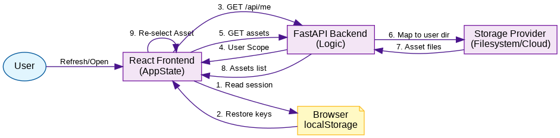

# Design Document: Persistence and User Management

This document outlines the design for session persistence, user management, and asset isolation in the Papeterie Engine.

---

## 🎭 1. Session Persistence

To ensure users can resume their work exactly where they left off, we will implement client-side session persistence.

### 1.1 Frontend State Sync
The `App.jsx` state (selected item, current view, expansion state) will be synchronized with `localStorage`.

| State Key | Storage Value | Description |
|-----------|---------------|-------------|
| `selectedItem` | `{ name: string, type: 'scene'\|'sprite' }` | The last selected asset |
| `view` | `string` | The active view ('scene-detail', 'sprite-detail', etc.) |
| `isExpanded` | `boolean` | Side-panel or theatre expansion state |

---

## 👤 2. User Management & SQL

We will transition from a single-user local environment to a multi-user system using a database for metadata.

### 2.1 Why SQL?
We will use **SQLite** (a lightweight SQL database that is just a file on your disk) to store:
- **User Credentials**: Usernames and secure password hashes.
- **Permissions**: Which user owns which sprite or scene.
- **Relationships**: Tracking which sprites are shared between users.

> [!NOTE]
> SQL is better than JSON for this because it handles many users writing at once without data corruption, and it allows us to quickly find "all scenes owned by User X" without reading every file on disk.

### 2.2 User Model
| Property | Type | Description |
|----------|------|-------------|
| `id` | `uuid` | Unique identifier |
| `username` | `string` | User's display name |
| `email` | `string` | Unique email for login |
| `password_hash`| `string` | Argon2 hash (never store plain passwords) |

---

## 📂 3. Asset Isolation and Storage

Assets must be isolated per user to ensure privacy and security.

### 3.1 Directory Structure (File System)
```text
assets/
└── users/
    ├── <user_id_1>/
    │   ├── sprites/
    │   └── scenes/
    └── <user_id_2>/
        ├── sprites/
        └── scenes/
```

### 3.2 Choosing Storage: Local vs Cloud
The user (or system administrator) chooses the storage mode via an **Environment Variable** in a `.env` file.

```bash
# Example .env configuration
STORAGE_MODE=LOCAL  # Options: LOCAL, S3, GCS
STORAGE_ROOT=./assets/users
```

The backend server reads this value at startup and instantiates the appropriate `StorageProvider`.

| Mode | Behavior | Best For |
|------|----------|----------|
| **LOCAL** | Saves files to the `assets/users/` folder on your computer. | Local development, single-user hobbyists. |
| **S3/GCS** | Uploads files to Amazon S3 or Google Cloud Storage. | Multi-user production apps, collaboration. |

---

## 🖼️ 4. System Flow

The following diagram illustrates how a user session is restored and assets are loaded within the multi-user architecture.


> [Source (DOT)](assets/diagrams/persistence_flow.dot)
