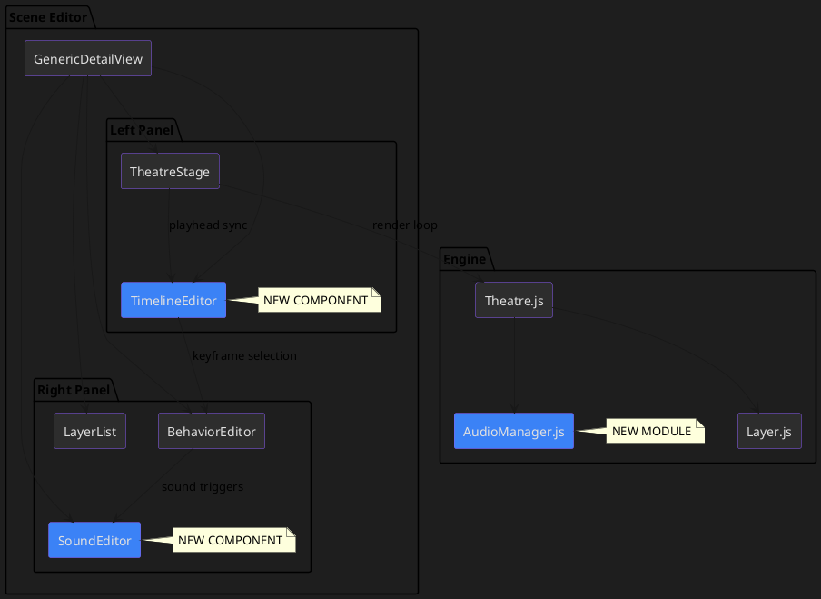
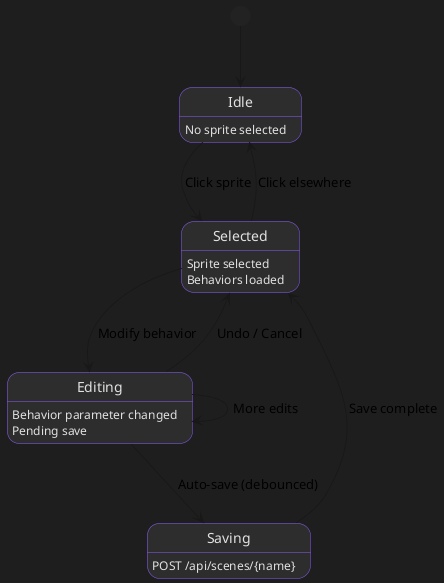

# Scene Editing Architecture

The Papeterie Engine provides a comprehensive system for creating and editing 2D "Toy Theatre" animations through scene configuration, sprite behaviors, and an interactive web frontend.

---

## 1. Overview

### Purpose
The scene editing system enables:
- **Composing scenes** from reusable sprite assets
- **Defining behaviors** that animate sprites with physics-based motion
- **Live previewing** animations in a web-based theatre stage
- **Persisting changes** back to JSON configuration files

### Key Concepts

| Concept | Description |
|---------|-------------|
| **Scene** | A composition of layers with a name and duration |
| **Layer** | An instance of a sprite within a scene, with position and behavior overrides |
| **Sprite** | A reusable image asset with default metadata |
| **Behavior** | A unit of animation logic (oscillate, drift, pulse, etc.) |

---

## 2. Use Cases

High-level user scenarios that drive the scene editing system design.

### UC-1: Compose a Scene
**As a** content creator, **I want to** drag sprites onto a stage and arrange them visually **so that** I can compose scenes without editing JSON.

**Flow:**
1. Open scene editor
2. Add sprites from library
3. Position sprites via drag-and-drop
4. Set z-depth for layering
5. Save scene

**Implementation Status:** ✅ Implemented (drag-to-position, z_depth, save to JSON)

---

### UC-2: Animate a Sprite
**As a** content creator, **I want to** add behaviors like bobbing, drifting, or pulsing to sprites **so that** scenes feel alive.

**Flow:**
1. Select sprite in scene
2. Open Behaviors tab
3. Add behavior (oscillate, drift, pulse)
4. Tune parameters (frequency, amplitude)
5. Preview in real-time

**Implementation Status:** ✅ Implemented (`BehaviorEditor` with Motion/Sound tabs)

---

### UC-3: Create Keyframe Animation
**As an** animator, **I want to** position a sprite at different times **so that** it moves along a path during playback.

**Flow:**
1. Play scene in editor
2. Scrub to desired time
3. Drag sprite to new position
4. Keyframe saved with `time_offset`
5. Repeat for animation path

**Implementation Status:** ✅ Implemented (`TimelineEditor`, `LocationBehavior` with `time_offset`)

---

### UC-4: Add Sound Effects
**As a** content creator, **I want to** trigger sounds at specific times or events **so that** scenes have audio.

**Flow:**
1. Select sprite or scene
2. Switch to Sound tab
3. Add sound behavior
4. Choose sound file, set trigger (time or event)
5. Preview with audio

**Implementation Status:** 🔶 Partial (`SoundBehavior` model exists, `AudioManager.js` implemented, UI needs sound file picker)

---

### UC-5: React to Environment
**As an** animator, **I want** a boat to tilt with waves **so that** it looks realistic.

**Flow:**
1. Configure wave sprite with oscillating Y
2. Add `environmental_reaction` to boat
3. Set `target_sprite_name` to wave
4. Tune `max_tilt_angle`, `vertical_follow_factor`
5. Preview physics interaction

**Implementation Status:** ✅ Implemented (`pivot_on_crest` reaction type)

---

### UC-6: Debug Scene Issues
**As a** developer, **I want to** see layer telemetry and toggle visibility **so that** I can diagnose rendering problems.

**Flow:**
1. Play scene
2. Open Debug tab
3. View X/Y/Tilt values
4. Toggle layer visibility
5. Identify and fix issues

**Implementation Status:** ✅ Implemented (Debug tab, telemetry, visibility toggles)

---

## 3. Data Model

The data model is defined in [`src/compiler/models.py`](file:///home/chacker/projects/papeterie-engine/src/compiler/models.py) using Pydantic.

### SceneConfig

Top-level scene definition.

```json
{
  "name": "My Scene",
  "layers": [ /* SceneLayer objects */ ]
}
```

### SceneLayer

An instance of a sprite in a scene with optional overrides.

| Property | Type | Description |
|----------|------|-------------|
| `sprite_name` | string | Name of sprite directory (required) |
| `z_depth` | int (1-100) | Visual stacking order |
| `x_offset`, `y_offset` | int | Position offsets in pixels |
| `scale` | float | Scale multiplier |
| `vertical_percent` | float (0-1) | Vertical anchor as screen percentage |
| `behaviors` | array | Scene-specific behaviors (see §4) |

#### Legacy Fields (deprecated)

> [!WARNING]
> The following fields are **deprecated** and must be migrated to behaviors.

**SceneLayer Legacy Fields:**

| Legacy Field | Behavior Equivalent |
|--------------|---------------------|
| `frequency` + `amplitude_y` | `OscillateBehavior(coordinate="y")` |
| `scroll_speed` | `BackgroundBehavior(scroll_speed=X)` |

**SpriteMetadata Legacy Fields:**

| Legacy Field | Behavior Equivalent |
|--------------|---------------------|
| `frequency` + `amplitude_y` | `OscillateBehavior(coordinate="y")` |
| `vertical_drift` | `DriftBehavior(coordinate="y")` |
| `horizontal_drift` | `DriftBehavior(coordinate="x")` |
| `scale_drift` | `DriftBehavior(coordinate="scale")` |
| `twinkle_amplitude` + `twinkle_frequency` | `PulseBehavior(coordinate="opacity")` |

**Migration Script:**
```bash
# Preview all changes
python scripts/migrate_legacy_behaviors.py --dry-run

# Migrate sprites only
python scripts/migrate_legacy_behaviors.py --sprites-only

# Migrate scenes only
python scripts/migrate_legacy_behaviors.py --scenes-only

# Apply all changes
python scripts/migrate_legacy_behaviors.py
```

See [`scripts/migrate_legacy_behaviors.py`](file:///home/chacker/projects/papeterie-engine/scripts/migrate_legacy_behaviors.py) for implementation.

### SpriteMetadata

Default properties for a sprite asset, stored in `<sprite>.prompt.json`.

| Property | Type | Description |
|----------|------|-------------|
| `z_depth` | int | Default layer depth |
| `vertical_percent` | float | Default vertical position |
| `target_height` | int | Scaled height in pixels |
| `tile_horizontal` | bool | Tile to fill screen width |
| `fill_down` | bool | Extend bottom edge with solid color |
| `vertical_anchor` | "top" / "center" / "bottom" | Anchor point for positioning |
| `behaviors` | array | Default behaviors |
| `environmental_reaction` | object | Environmental reaction config (see §3.2) |

---

## 3. Behavior System

Behaviors are modular animation units that modify sprite transforms over time.

### 3.1 Behavior Types

#### Oscillate
Applies sine-wave motion to a property.

```json
{
  "type": "oscillate",
  "enabled": true,
  "coordinate": "y",
  "frequency": 0.5,
  "amplitude": 10,
  "phase_offset": 0
}
```

| Field | Description |
|-------|-------------|
| `frequency` | Cycles per second (Hz) |
| `amplitude` | Maximum offset |
| `phase_offset` | Phase in radians |
| `coordinate` | Property: "x", "y", "scale", "rotation", "opacity" |

#### Drift
Applies continuous linear motion.

```json
{
  "type": "drift",
  "enabled": true,
  "coordinate": "y",
  "velocity": 20,
  "acceleration": 0,
  "drift_cap": 100,
  "cap_behavior": "stop"
}
```

| Field | Description |
|-------|-------------|
| `velocity` | Units per second |
| `drift_cap` | Optional hard limit |
| `cap_behavior` | "stop", "bounce", or "loop" |

#### Pulse
Modulates opacity or scale (twinkle effects).

```json
{
  "type": "pulse",
  "enabled": true,
  "coordinate": "opacity",
  "frequency": 1.0,
  "min_value": 0.5,
  "max_value": 1.0,
  "waveform": "sine"
}
```

#### Background
Marks a layer as static background.

```json
{
  "type": "background",
  "enabled": true,
  "scroll_speed": 0.0
}
```

#### Location
Sets position with optional timeline keyframes.

```json
{
  "type": "location",
  "enabled": true,
  "x": 100,
  "y": 50,
  "time_offset": 2.0,
  "interpolate": true
}
```

| Field | Description |
|-------|-------------|
| `time_offset` | When position applies (seconds) |
| `interpolate` | Smooth transition from previous keyframe |

### 3.2 Environmental Reactions

Sprites can react to other layers in the scene (e.g., boat tilting on waves).

```json
{
  "environmental_reaction": {
    "reaction_type": "pivot_on_crest",
    "target_sprite_name": "wave1",
    "max_tilt_angle": 30.0,
    "vertical_follow_factor": 0.35,
    "tilt_lift_factor": 1.5,
    "hull_length_factor": 0.5
  }
}
```

| Field | Description |
|-------|-------------|
| `reaction_type` | Currently only "pivot_on_crest" |
| `target_sprite_name` | Layer to react to |
| `max_tilt_angle` | Maximum rotation in degrees |
| `vertical_follow_factor` | How much to follow target's Y (0-1) |
| `tilt_lift_factor` | Vertical lift per degree of tilt |
| `hull_length_factor` | Sampling width as fraction of sprite width |

### 3.3 Future: Sound Effects & Timeline

> [!NOTE]
> Planned extensions for sound-triggered behaviors and advanced timeline editing.

---

## 4. Frontend Architecture

### 4.1 Component Hierarchy

```
App
└── GenericDetailView (Scene/Sprite detail)
    ├── TheatreStage (Canvas preview)
    ├── BehaviorEditor (Edit behaviors panel)
    ├── ImageViewer (Static image preview)
    └── LogPanel (System logs)
```

| Component | File | Purpose |
|-----------|------|---------|
| `GenericDetailView` | [`GenericDetailView.jsx`](file:///home/chacker/projects/papeterie-engine/src/web/src/components/GenericDetailView.jsx) | Main detail view for scenes/sprites |
| `BehaviorEditor` | [`BehaviorEditor.jsx`](file:///home/chacker/projects/papeterie-engine/src/web/src/components/BehaviorEditor.jsx) | Add/edit/remove behaviors |
| `TheatreStage` | [`TheatreStage.jsx`](file:///home/chacker/projects/papeterie-engine/src/web/src/components/TheatreStage.jsx) | Live canvas preview |

### 4.2 Engine Layer

The animation engine runs in JavaScript.

| File | Purpose |
|------|---------|
| [`Theatre.js`](file:///home/chacker/projects/papeterie-engine/src/web/src/engine/Theatre.js) | Scene orchestration, render loop, sprite selection |
| [`Layer.js`](file:///home/chacker/projects/papeterie-engine/src/web/src/engine/Layer.js) | Layer rendering, behavior runtime classes |

**Runtime Classes** (in `Layer.js`):
- `OscillateRuntime` - Sine-wave animation
- `DriftRuntime` - Linear motion
- `PulseRuntime` - Opacity/scale pulsing
- `BackgroundRuntime` - Static positioning
- `LocationRuntime` - Keyframe positioning

### 4.3 State Management

The `useAssetController` hook manages:
- Loading scene/sprite data from API
- Tracking selected sprite and behaviors
- Persisting behavior changes via `handleEventsChange`
- Drag-to-position updates via `handleSpritePositionChanged`

---

## 5. UX Patterns

### 5.1 Behavior Editing

1. **Select sprite** in TheatreStage (click) or Debug tab
2. **View behaviors** in BehaviorEditor panel
3. **Add behavior** via dropdown menu
4. **Edit parameters** inline (frequency, amplitude, etc.)
5. **Remove behavior** via delete button

### 5.2 Debug Mode

Toggle debug mode to see:
- Layer visibility checkboxes
- Pink debug dot showing sample position
- Real-time telemetry (position, tilt)

### 5.3 Drag-to-Position

1. **Click** sprite to select
2. **Drag** to new position
3. Position saved as `LocationBehavior` with current time offset

### 5.4 Asset Lifecycle

Visualized via `StatusStepper`:
- **Import** → **Optimize** (AI) → **Configure** → **Ready**

---

## 6. Quick Reference

### Complete Scene Example

```json
{
  "name": "Sailboat Scene",
  "layers": [
    {
      "sprite_name": "stars",
      "z_depth": 1,
      "behaviors": [
        { "type": "background", "enabled": true, "scroll_speed": 0.0 }
      ]
    },
    {
      "sprite_name": "wave1",
      "z_depth": 5,
      "vertical_percent": 0.55,
      "behaviors": [
        { "type": "oscillate", "coordinate": "y", "frequency": 0.06, "amplitude": 4 }
      ]
    },
    {
      "sprite_name": "boat",
      "z_depth": 6,
      "vertical_percent": 0.7,
      "behaviors": []
    }
  ]
}
```

### Adding a New Behavior Type

1. Add to `BehaviorType` enum in [`models.py`](file:///home/chacker/projects/papeterie-engine/src/compiler/models.py)
2. Create Pydantic model extending `BaseBehavior`
3. Add to `BehaviorConfig` union
4. Create runtime class in [`Layer.js`](file:///home/chacker/projects/papeterie-engine/src/web/src/engine/Layer.js)
5. Add UI fields in [`BehaviorEditor.jsx`](file:///home/chacker/projects/papeterie-engine/src/web/src/components/BehaviorEditor.jsx)

---

## 7. UI Design: Timeline & Behavior Editing

This section provides detailed UI design specifications for implementing advanced scene editing features.

### 7.1 Component Architecture



### 7.2 Timeline Editor Component

The Timeline Editor provides visual control over time-based behaviors.

#### UI Layout

```
┌─────────────────────────────────────────────────────────────────┐
│ Timeline                                            [▶ Play] ⚙  │
├─────────────────────────────────────────────────────────────────┤
│ 0s        5s        10s       15s       20s       25s      30s │
│ ├─────────┼─────────┼─────────┼─────────┼─────────┼─────────┤  │
│     ▼ (playhead)                                                │
├─────────────────────────────────────────────────────────────────┤
│ 🚢 boat      ●────────────●────────────●                        │
│ 🌊 wave1     ════════════════════════════════════               │
│ ⭐ stars     ════════════════════════════════════               │
│ 🔊 splash    ○           ○                                      │
└─────────────────────────────────────────────────────────────────┘
  Legend: ● = Position keyframe, ═ = Continuous behavior, ○ = Sound trigger
```

#### Data Model Extension

```python
# New fields for SceneConfig
class SceneConfig(BaseModel):
    name: str
    layers: List[SceneLayer]
    duration_sec: float = Field(30.0, description="Scene duration in seconds")
    sounds: List[SoundBehavior] = Field(default_factory=list)
```

#### Props Interface

```typescript
interface TimelineEditorProps {
  duration: number;                    // Scene duration in seconds
  currentTime: number;                 // Playhead position
  layers: SceneLayer[];                // All layers
  selectedLayer: string | null;        // Currently selected layer
  onTimeChange: (time: number) => void;
  onKeyframeAdd: (layer: string, time: number) => void;
  onKeyframeMove: (layer: string, index: number, newTime: number) => void;
  onKeyframeDelete: (layer: string, index: number) => void;
  onPlayPause: () => void;
  isPlaying: boolean;
}
```

### 7.3 Sound Behavior System

#### Data Model

```python
class SoundBehavior(BaseBehavior):
    """Triggers audio playback at specific times or events."""
    type: Literal[BehaviorType.SOUND] = BehaviorType.SOUND
    coordinate: CoordinateType = Field(CoordinateType.Y, description="Ignored")
    
    # Sound configuration
    sound_file: str = Field(..., description="Path to audio file relative to assets/sounds/")
    volume: float = Field(1.0, ge=0.0, le=1.0, description="Playback volume")
    
    # Trigger configuration (mutually exclusive)
    time_offset: Optional[float] = Field(None, description="Trigger at specific time (seconds)")
    trigger_event: Optional[str] = Field(None, description="Trigger on event: 'crest_peak', 'loop_start'")
    
    # Playback options
    loop: bool = Field(False, description="Loop the sound")
    fade_in: float = Field(0.0, description="Fade in duration (seconds)")
    fade_out: float = Field(0.0, description="Fade out duration (seconds)")
```

#### UI Component

```
┌─────────────────────────────────────────────┐
│ 🔊 SOUND (splash.mp3)               [🗑 ×] │
├─────────────────────────────────────────────┤
│ Sound File    [splash.mp3          ▼]      │
│ Volume        [━━━━━━━━━○━━] 0.8           │
│ ─────────────────────────────────────────  │
│ Trigger Mode  ○ Time  ● Event              │
│ Event         [crest_peak          ▼]      │
│ ─────────────────────────────────────────  │
│ ☐ Loop   Fade In [0.0s]  Fade Out [0.2s]  │
└─────────────────────────────────────────────┘
```

### 7.4 Enhanced Behavior Editor

#### Tabbed Interface

```
┌───────────────────────────────────────────────────────────┐
│ Editing: boat                      👁 [Hide] [🗑 Remove] │
├─────────────────────────────────────────────────────────────┤
│ [Motion] [Sound] [Environment] [Timeline]                  │
├─────────────────────────────────────────────────────────────┤
│                                                             │
│  Motion Tab Content (current BehaviorEditor)               │
│                                                             │
└─────────────────────────────────────────────────────────────┘
```

#### Tab Definitions

| Tab | Contents |
|-----|----------|
| **Motion** | Oscillate, Drift, Pulse, Location behaviors |
| **Sound** | SoundBehavior instances for this layer |
| **Environment** | Environmental reaction configuration |
| **Timeline** | Keyframe list view (alternative to visual timeline) |

### 7.5 State Flow



### 7.6 API Endpoints

| Method | Endpoint | Purpose |
|--------|----------|---------|
| `GET` | `/api/scenes/{name}` | Load scene config |
| `PUT` | `/api/scenes/{name}` | Save scene config |
| `PUT` | `/api/scenes/{name}/layers/{sprite}` | Update single layer |
| `POST` | `/api/scenes/{name}/layers/{sprite}/keyframe` | Add keyframe |
| `DELETE` | `/api/scenes/{name}/layers/{sprite}/keyframe/{idx}` | Remove keyframe |
| `GET` | `/api/sounds` | List available sound files |

---

## 8. Implementation Specifications

> [!IMPORTANT]
> This section provides detailed implementation guidance for AI developer agents.

### 8.1 TimelineEditor Implementation

**File**: `src/web/src/components/TimelineEditor.jsx`

```jsx
// Key implementation requirements:

// 1. Playhead Control
// - Draggable playhead indicator
// - Click-to-seek on ruler
// - Keyboard: Space = play/pause, Arrow keys = frame step

// 2. Layer Tracks
// - One track per SceneLayer
// - Show layer name with icon
// - Highlight selected layer

// 3. Keyframe Markers
// - Extract LocationBehavior with time_offset > 0
// - Draggable keyframe dots
// - Double-click to edit keyframe
// - Right-click context menu (Delete, Duplicate)

// 4. Sync with Theatre
// - Pass currentTime to Theatre.js
// - Theatre updates elapsedTime for render

// 5. CSS Styling
// - Dark theme (#1e1e1e background)
// - Violet accent (#8b5cf6) for selection
// - Grid lines at 1s intervals
```

**State Requirements**:
```typescript
const [playhead, setPlayhead] = useState(0);
const [isPlaying, setIsPlaying] = useState(false);
const [zoom, setZoom] = useState(1); // pixels per second

useEffect(() => {
  if (isPlaying) {
    const interval = setInterval(() => {
      setPlayhead(prev => (prev + 0.016) % duration);
    }, 16);
    return () => clearInterval(interval);
  }
}, [isPlaying, duration]);
```

### 8.2 SoundBehavior Implementation

**Backend** (`models.py`):
```python
class BehaviorType(str, Enum):
    # ... existing types ...
    SOUND = "sound"  # ADD THIS

class SoundBehavior(BaseBehavior):
    type: Literal[BehaviorType.SOUND] = BehaviorType.SOUND
    sound_file: str = Field(..., description="Sound file path")
    volume: float = Field(1.0, ge=0.0, le=1.0)
    time_offset: Optional[float] = None
    trigger_event: Optional[str] = None
    loop: bool = False
    fade_in: float = 0.0
    fade_out: float = 0.0

# Update BehaviorConfig union
BehaviorConfig = Union[
    OscillateBehavior, DriftBehavior, PulseBehavior, 
    BackgroundBehavior, LocationBehavior, SoundBehavior  # ADD
]
```

**Frontend Engine** (`AudioManager.js`):
```javascript
export class AudioManager {
  constructor() {
    this.sounds = new Map(); // name -> HTMLAudioElement
    this.scheduled = [];     // pending time-based triggers
  }

  async loadSound(name, url) {
    const audio = new Audio(url);
    await audio.load();
    this.sounds.set(name, audio);
  }

  scheduleAt(name, time, options = {}) {
    this.scheduled.push({ name, time, ...options });
  }

  update(currentTime) {
    for (const s of this.scheduled) {
      if (currentTime >= s.time && !s.played) {
        this.play(s.name, s);
        s.played = true;
      }
    }
  }

  play(name, { volume = 1, loop = false } = {}) {
    const audio = this.sounds.get(name);
    if (audio) {
      audio.volume = volume;
      audio.loop = loop;
      audio.currentTime = 0;
      audio.play();
    }
  }
}
```

### 8.3 BehaviorEditor Enhancement

**Add tabs** to existing `BehaviorEditor.jsx`:

```jsx
const TABS = ['Motion', 'Sound', 'Environment', 'Timeline'];
const [activeTab, setActiveTab] = useState('Motion');

// Filter behaviors by tab
const motionBehaviors = behaviors.filter(b => 
  ['oscillate', 'drift', 'pulse', 'location', 'background'].includes(b.type)
);
const soundBehaviors = behaviors.filter(b => b.type === 'sound');

// Render tab content
{activeTab === 'Motion' && <MotionBehaviorList behaviors={motionBehaviors} ... />}
{activeTab === 'Sound' && <SoundBehaviorList behaviors={soundBehaviors} ... />}
{activeTab === 'Environment' && <EnvironmentEditor reaction={environmentalReaction} ... />}
{activeTab === 'Timeline' && <KeyframeList layer={selectedLayer} ... />}
```

### 8.4 Integration Status

> [!NOTE]
> Most core features have been implemented. Status as of Jan 2026.

**Phase 1: Timeline Foundation ✅**
- [x] Create `TimelineEditor.jsx` component
- [x] Add `duration_sec` to `SceneConfig` model
- [x] Wire playhead to `Theatre.js` via props
- [x] Extract keyframes from `LocationBehavior` for display

**Phase 2: Sound System 🔶**
- [x] Add `SoundBehavior` to `models.py`
- [x] Create `AudioManager.js` engine module
- [x] Add Sound tab to `BehaviorEditor.jsx`
- [ ] Create `/api/sounds` endpoint (file listing)
- [ ] Add sound file picker UI in BehaviorEditor

**Phase 3: Enhanced Editing ⏳**
- [x] Add keyframe markers to timeline (view-only)
- [ ] Add draggable keyframes to timeline
- [ ] Implement keyframe add/delete context menu
- [ ] Add debounced auto-save to `useAssetController`
- [ ] Add undo/redo stack

### 8.5 Testing Requirements

```javascript
// TimelineEditor.test.jsx
describe('TimelineEditor', () => {
  it('renders layer tracks for each SceneLayer', () => {});
  it('updates playhead on click', () => {});
  it('extracts keyframes from LocationBehaviors', () => {});
  it('calls onKeyframeMove when dragged', () => {});
});

// AudioManager.test.js
describe('AudioManager', () => {
  it('plays sound at scheduled time', () => {});
  it('respects volume setting', () => {});
  it('handles loop option', () => {});
});
```

---

## 9. Feature Backlog

Unprioritized features for future implementation with high-level design guidance.

### FB-1: Sound File Picker ⭐ Easy
**Gap:** Sound behaviors exist but no UI to browse/select audio files.

**Design Guidance:**
1. Add `/api/sounds` endpoint listing `assets/sounds/*.mp3|.wav|.ogg`
2. In `BehaviorEditor` Sound tab, replace text input with dropdown populated from API
3. Add "Upload Sound" button that POSTs to `/api/sounds/upload`

**Files to Modify:**
- `src/server/main.py` - Add sounds endpoint
- `src/web/src/components/BehaviorEditor.jsx` - Add file picker

---

### FB-2: Draggable Timeline Keyframes ⭐ Medium
**Gap:** Keyframes display on timeline but cannot be dragged to new times.

**Design Guidance:**
1. Add `onMouseDown` handler to keyframe markers in `TimelineEditor`
2. Calculate new `time_offset` based on drag position
3. Call `onKeyframeMove(layer, idx, newTime)` prop
4. Parent updates `LocationBehavior.time_offset` and saves

**UI Interaction:**
```
Drag keyframe → Update time_offset → Save to JSON → Refresh preview
```

---

### FB-3: Environment Reaction Editor ⭐ Medium
**Gap:** `environmental_reaction` can only be configured via JSON. No dedicated UI.

**Design Guidance:**
1. Add "Environment" tab to `BehaviorEditor`
2. Create `EnvironmentReactionEditor` component
3. Fields: `target_sprite_name` (dropdown of other layers), `max_tilt_angle`, `vertical_follow_factor`
4. Update `handleEventsChange` to handle `environmental_reaction` field separately

**Note:** This is distinct from behaviors—it's a direct field on `SpriteMetadata`/`SceneLayer`.

---

### FB-4: Undo/Redo Stack ⭐ Medium
**Gap:** No way to undo accidental changes.

**Design Guidance:**
1. Implement history stack in `useAssetController`
2. Store diffs or snapshots of `asset.config` on each change
3. Add `handleUndo()`/`handleRedo()` functions
4. Wire to keyboard shortcuts (Ctrl+Z, Ctrl+Y)
5. UI: Add undo/redo buttons to toolbar

**State Structure:**
```javascript
const [history, setHistory] = useState([]);
const [historyIndex, setHistoryIndex] = useState(-1);
```

---

### FB-5: Export Scene to Video ⭐ Large
**Gap:** Can preview scenes but no export capability.

**Design Guidance:**
1. Add `/api/scenes/{name}/export` POST endpoint
2. Backend uses `moviepy` to render frames from `Theatre.py`
3. Return download URL or stream video
4. UI: Add "Export" button in scene toolbar

**Prerequisites:**
- Ensure Python renderer matches JS renderer output
- Consider headless Chrome for pixel-perfect match

---

### FB-6: Sprite Library Sidebar ⭐ Medium
**Gap:** Must know sprite names manually when adding to scenes.

**Design Guidance:**
1. Add collapsible sidebar to scene editor
2. List all sprites from `/api/sprites`
3. Drag sprite from library → Add to scene layers
4. Auto-position at click location or center

---

### FB-7: Advanced Trigger Events ⭐ Large
**Gap:** Sound `trigger_event` only supports hardcoded strings.

**Design Guidance:**
1. Define event registry (e.g., `crest_peak`, `loop_start`, `collision`)
2. Enhance `Theatre.js` to emit events during playback
3. `AudioManager` listens for events, not just time-based triggers
4. UI: Show event dropdown in Sound behavior editor

---

## 10. Design Principles for New Features

When implementing new scene editing features, follow these principles:

### Data-First Design
1. **Define Pydantic model** in `models.py` first
2. **Add to BehaviorConfig union** if it's a behavior
3. **Update OpenAPI spec** via FastAPI auto-docs

### Frontend Implementation
1. **Create Runtime class** in `Layer.js` (or new module)
2. **Add to BehaviorEditor** with appropriate tab
3. **Wire through useAssetController** for persistence

### Testing
1. **Backend:** Add Pydantic validation tests
2. **Frontend:** Add component tests with Vitest
3. **Integration:** Verify JSON round-trip saves correctly

### UX Guidelines
- **Dark theme:** `#1e1e1e` background, `#8b5cf6` accent
- **Feedback:** Use `toast` for actions, never `alert()`
- **Consistency:** All behaviors follow same card layout in editor
- **Labels:** Use 0.75rem font for field labels, 0.8rem for values
