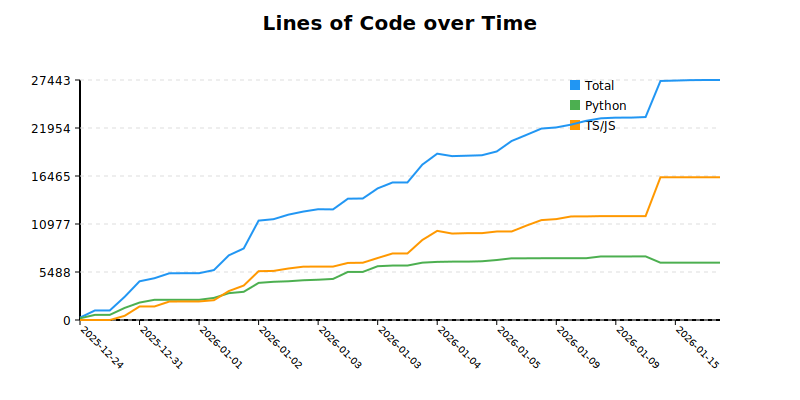
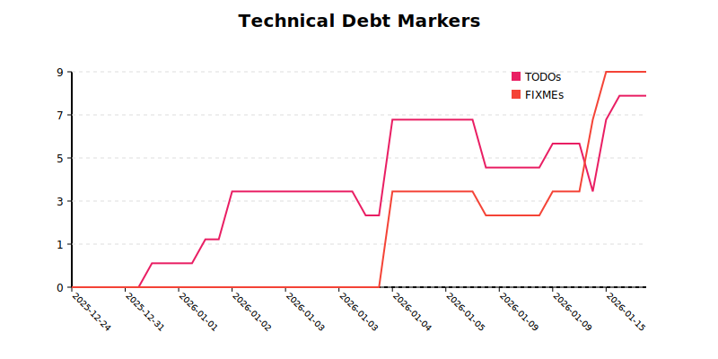

# Project History Analysis
Generated on 2026-01-15T23:04:01.209042
## Summary
- **Analysis Period**: 2025-12-24 to 2026-01-15 (22 days)
- **Total Growth**: +27,166 LOC
- **Avg Metrics**: +1234.82 Lines/Day

## Project Growth

## Technical Debt

## Commit History

| Date | Commit | Author | Total LOC | Py LOC | TS/JS LOC | MD LOC | Tests | TODOs | NEEDS_FIX |
|---|---|---|---|---|---|---|---|---|---|
| 2025-12-24 | `341bc82` | CharlesJ Hacker | 277 | 197 | 0 | 80 | 4 | 0 | 0 |
| 2025-12-30 | `25f3f41` | charo | 1089 | 586 | 0 | 503 | 6 | 0 | 0 |
| 2025-12-30 | `55bd4f3` | charo | 1090 | 586 | 0 | 504 | 6 | 0 | 0 |
| 2025-12-31 | `f1a958b` | charo | 2652 | 1383 | 479 | 637 | 8 | 0 | 0 |
| 2025-12-31 | `aceba04` | CharlesJ Hacker | 4425 | 1994 | 1546 | 724 | 11 | 0 | 0 |
| 2025-12-31 | `235984d` | CharlesJ Hacker | 4776 | 2309 | 1546 | 760 | 12 | 0 | 0 |
| 2026-01-01 | `af48c3a` | CharlesJ Hacker | 5339 | 2309 | 2109 | 760 | 12 | 1 | 0 |
| 2026-01-01 | `391ba0f` | CharlesJ Hacker | 5351 | 2309 | 2121 | 760 | 12 | 1 | 0 |
| 2026-01-01 | `9380c9a` | CharlesJ Hacker | 5351 | 2309 | 2121 | 760 | 12 | 1 | 0 |
| 2026-01-01 | `4b57a91` | CharlesJ Hacker | 5712 | 2526 | 2265 | 760 | 13 | 1 | 0 |
| 2026-01-01 | `466f58d` | CharlesJ Hacker | 7396 | 3069 | 3311 | 855 | 14 | 2 | 0 |
| 2026-01-02 | `e2ef761` | CharlesJ Hacker | 8180 | 3225 | 3939 | 855 | 18 | 2 | 0 |
| 2026-01-02 | `d86e507` | CharlesJ Hacker | 11364 | 4245 | 5582 | 1376 | 28 | 4 | 0 |
| 2026-01-03 | `41997be` | CharlesJ Hacker | 11527 | 4369 | 5611 | 1386 | 29 | 4 | 0 |
| 2026-01-03 | `0d7a282` | CharlesJ Hacker | 12045 | 4428 | 5888 | 1409 | 29 | 4 | 0 |
| 2026-01-03 | `685d4f2` | CharlesJ Hacker | 12398 | 4545 | 6098 | 1435 | 30 | 4 | 0 |
| 2026-01-03 | `a0bc2b7` | CharlesJ Hacker | 12666 | 4605 | 6108 | 1633 | 30 | 4 | 0 |
| 2026-01-03 | `ed9434f` | CharlesJ Hacker | 12647 | 4696 | 6108 | 1523 | 29 | 4 | 0 |
| 2026-01-03 | `25a7099` | CharlesJ Hacker | 13871 | 5499 | 6526 | 1524 | 32 | 4 | 0 |
| 2026-01-03 | `4c9e595` | CharlesJ Hacker | 13893 | 5499 | 6548 | 1524 | 32 | 4 | 0 |
| 2026-01-03 | `b5949ce` | CharlesJ Hacker | 15051 | 6149 | 7089 | 1491 | 39 | 4 | 0 |
| 2026-01-04 | `df1bb79` | CharlesJ Hacker | 15728 | 6226 | 7608 | 1553 | 39 | 4 | 0 |
| 2026-01-04 | `e05e180` | CharlesJ Hacker | 15730 | 6226 | 7610 | 1553 | 39 | 3 | 0 |
| 2026-01-04 | `4a8e17b` | CharlesJ Hacker | 17768 | 6556 | 9149 | 1730 | 41 | 3 | 0 |
| 2026-01-04 | `a0d3d05` | CharlesJ Hacker | 19018 | 6646 | 10192 | 1847 | 42 | 7 | 4 |
| 2026-01-04 | `b8eb09f` | CharlesJ Hacker | 18739 | 6674 | 9884 | 1848 | 42 | 7 | 4 |
| 2026-01-04 | `221a135` | CharlesJ Hacker | 18786 | 6674 | 9931 | 1848 | 42 | 7 | 4 |
| 2026-01-05 | `9b05fd8` | CharlesJ Hacker | 18837 | 6715 | 9930 | 1859 | 42 | 7 | 4 |
| 2026-01-05 | `32c6898` | CharlesJ Hacker | 19271 | 6859 | 10120 | 1959 | 43 | 7 | 4 |
| 2026-01-06 | `8b555d4` | CharlesJ Hacker | 20470 | 7055 | 10121 | 1967 | 50 | 7 | 4 |
| 2026-01-06 | `9f3676f` | CharlesJ Hacker | 21171 | 7055 | 10799 | 1967 | 51 | 7 | 4 |
| 2026-01-07 | `5b93b5c` | CharlesJ Hacker | 21888 | 7063 | 11423 | 1967 | 51 | 5 | 3 |
| 2026-01-09 | `1da56a0` | CharlesJ Hacker | 22020 | 7063 | 11537 | 1967 | 51 | 5 | 3 |
| 2026-01-09 | `e09c42b` | CharlesJ Hacker | 22341 | 7063 | 11842 | 1983 | 51 | 5 | 3 |
| 2026-01-09 | `8c8c386` | CharlesJ Hacker | 22773 | 7063 | 11845 | 2412 | 51 | 5 | 3 |
| 2026-01-09 | `5e7eb28` | CharlesJ Hacker | 23063 | 7268 | 11878 | 2414 | 51 | 5 | 3 |
| 2026-01-09 | `7770348` | CharlesJ Hacker | 23139 | 7268 | 11878 | 2490 | 51 | 6 | 4 |
| 2026-01-09 | `c0febb4` | CharlesJ Hacker | 23141 | 7268 | 11878 | 2492 | 51 | 6 | 4 |
| 2026-01-10 | `a977a72` | CharlesJ Hacker | 23207 | 7274 | 11878 | 2552 | 51 | 6 | 4 |
| 2026-01-15 | `6b7c7fe` | CharlesJ Hacker | 27333 | 6552 | 16321 | 1934 | 75 | 4 | 7 |
| 2026-01-15 | `8f2e41c` | CharlesJ Hacker | 27377 | 6552 | 16321 | 1978 | 75 | 7 | 9 |
| 2026-01-15 | `651f838` | CharlesJ Hacker | 27427 | 6552 | 16321 | 2028 | 75 | 8 | 9 |
| 2026-01-15 | `3b36cfb` | CharlesJ Hacker | 27443 | 6552 | 16321 | 2044 | 75 | 8 | 9 |
| 2026-01-15 | `4cfbb27` | CharlesJ Hacker | 27443 | 6552 | 16321 | 2044 | 75 | 8 | 9 |
