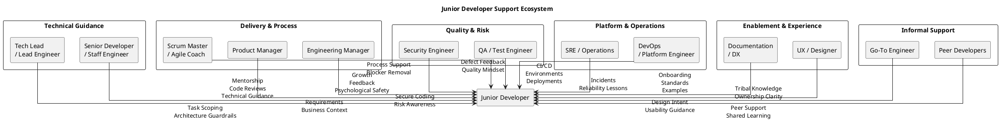

```plantuml
@startuml
title Junior Developer Support Ecosystem

skinparam packageStyle rectangle
skinparam shadowing false
skinparam linetype ortho

' Central role
rectangle "Junior Developer" as JD

' --- Technical Guidance ---
package "Technical Guidance" {
  rectangle "Senior Developer\n/ Staff Engineer" as SD
  rectangle "Tech Lead\n/ Lead Engineer" as TL
}

' --- Delivery & Process ---
package "Delivery & Process" {
  rectangle "Engineering Manager" as EM
  rectangle "Product Manager" as PM
  rectangle "Scrum Master\n/ Agile Coach" as SM
}

' --- Quality & Risk ---
package "Quality & Risk" {
  rectangle "QA / Test Engineer" as QA
  rectangle "Security Engineer" as SE
}

' --- Platform & Operations ---
package "Platform & Operations" {
  rectangle "DevOps\n/ Platform Engineer" as DE
  rectangle "SRE / Operations" as SRE
}

' --- Enablement ---
package "Enablement & Experience" {
  rectangle "UX / Designer" as UX
  rectangle "Documentation\n/ DX" as DX
}

' --- Informal Roles ---
package "Informal Support" {
  rectangle "Peer Developers" as PD
  rectangle "Go-To Engineer" as GE
}

' --- Relationships ---
SD --> JD : Mentorship\nCode Reviews\nTechnical Guidance
TL --> JD : Task Scoping\nArchitecture Guardrails

EM --> JD : Growth\nFeedback\nPsychological Safety
PM --> JD : Requirements\nBusiness Context
SM --> JD : Process Support\nBlocker Removal

QA --> JD : Defect Feedback\nQuality Mindset
SE --> JD : Secure Coding\nRisk Awareness

DE --> JD : CI/CD\nEnvironments\nDeployments
SRE --> JD : Incidents\nReliability Lessons

UX --> JD : Design Intent\nUsability Guidance
DX --> JD : Onboarding\nStandards\nExamples

PD --> JD : Peer Support\nShared Learning
GE --> JD : Tribal Knowledge\nOwnership Clarity

@enduml
```